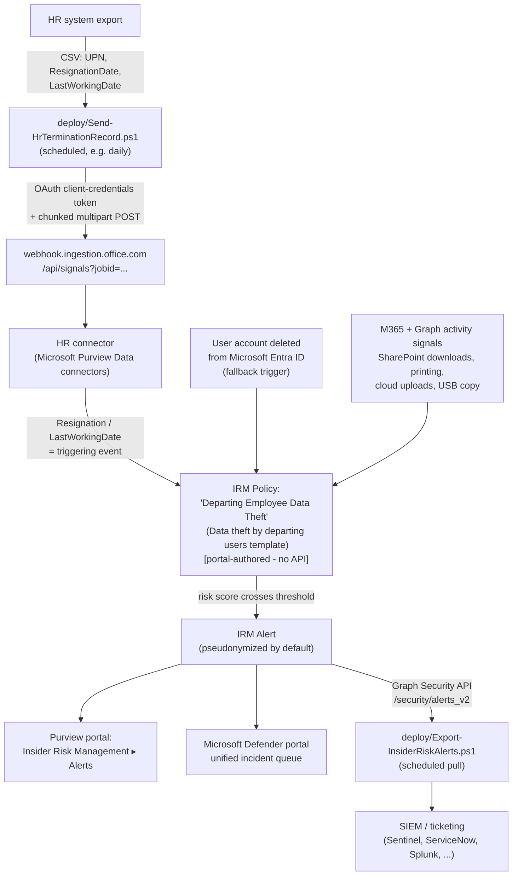

## The short version

Deploys Microsoft Purview Insider Risk Management's **Data theft by departing users** policy
template, fed by an automated daily HR resignation-date data upload, to detect and alert on
exfiltration-pattern activity (mass SharePoint/OneDrive downloads, printing, USB copying,
uploads to personal cloud storage) by employees who have resigned or been terminated - during
the highest-risk window: the notice period, before access is revoked. Generated alerts are
exportable via the Microsoft Graph security API for SIEM/ticketing integration.

## Why this matters

Departing employees are one of the highest-frequency, highest-impact insider-risk scenarios in
practice: legitimate access typically remains active through the last working day, and the
activity that constitutes theft (downloading a client list, a source-code repository, a deal
pipeline) is often indistinguishable from ordinary work *unless* it's correlated against
employment status and volume/pattern. No regulation names "insider risk management" as a
required control the way PCI DSS names messaging-technology PAN protection, but this control
supports several drivers an organization's compliance program will already be tracking:

- **Trade secret / IP protection** and **contractual confidentiality obligations** - the
  business rationale most organizations lead with; this is the technical control that lets a company
  demonstrate it had a monitoring program in place, which matters materially in trade-secret
  litigation (misappropriation claims commonly turn on whether "reasonable measures" to protect
  the secret existed).
- **SOC 2 / ISO 27001 access-and-termination control expectations** - auditors under both
  frameworks look for evidence of monitoring around personnel changes, not just an offboarding
  checklist; this scenario is that evidence for the "monitoring" half.
- **GDPR / data-protection accountability** - if a departing employee exfiltrates a customer
  database, the resulting breach-notification and accountability obligations fall on the
  employer regardless of the individual's culpability; early detection shortens the window
  between exfiltration and containment.
- **Insurance / cyber-liability underwriting** - insider-risk monitoring is an increasingly
  common underwriting question for cyber policies; this scenario is concrete evidence for that
  questionnaire.

## How the control works

Full rule-by-rule rationale, including exactly what this scenario can and cannot script, is in
the design notes.

## What it takes

### Prerequisites

Full licensing detail and citations: [Licensing matrix, section 2](/docs/licensing-matrix/#2-master-capability--license-matrix) (Insider Risk Management
row) and the prerequisites (add-on SKUs). Summary for this scenario:

| Requirement | Minimum | Notes |
|---|---|---|
| Insider Risk Management (all policies) | **Microsoft 365 E5/A5/G5**, **Microsoft Purview Suite**, or the **Microsoft 365 E5 Insider Risk Management** add-on | Cloud/GenAI indicators on non-M365 destinations (Box, Dropbox, Google Drive, Amazon S3, Azure) bill separately as **PAYG** (Data Security processing unit/day) |
| Role to configure policies/settings | **Insider Risk Management** or **Insider Risk Management Admins** role group | See section 6 below and [RBAC model, section 4](/docs/rbac-model/#4-purview-role-groups-by-module-representative-not-exhaustive) - narrower **Analyst**/**Investigator**/**Auditor** groups exist for day-2 operation without policy-authoring rights |
| Role to create the HR connector | **Data Connector Admin** role | Included by default in both role groups above |
| Microsoft 365 audit log | Enabled (default for most tenants) | Insider Risk Management scoring depends on it; confirm it hasn't been explicitly disabled |
| HR data source | Any system that can export **UserPrincipalName, ResignationDate, LastWorkingDate** to CSV | This scenario's `deploy/Send-HrTerminationRecord.ps1` uploads the CSV - it does not connect to or extract from the HR system itself |
| Entra app registration for the HR connector | App registration + client secret | Scripted - `deploy/Register-HrConnectorApp.ps1`, idempotent, `-WhatIf`-capable; see the implementation steps step 2 below. No special Entra role is needed to run it unless the tenant has disabled self-service app registration, in which case the operator needs the **Application Developer** role - [RBAC model, section 11](/docs/rbac-model/#11-microsoft-entra-app-registration-rbac---a-seventh-system-for-scenarios-that-create-their-own-app-registrations) |
| Automation identity for alert export | App registration with the Microsoft Graph **`SecurityAlert.Read.All`** application permission, certificate-based (this library's default pattern) | See [Automation surface, section 3](/docs/automation-surface/#3-authentication-patterns---interactive-vs-unattended); this is a *separate* app registration from the HR connector one above - different surface, different credential type |
| Device onboarding (optional) | Required only if device indicators (USB copy, printing, network-share transfer) are enabled | Same onboarding prerequisite as *Endpoint DLP: Block USB Removable Media Exfiltration* - see that scenario's page the prerequisites |

> **HR-connector app registration hygiene:** the Entra app `deploy/Register-HrConnectorApp.ps1`
> creates in Step 2 below is **single-purpose by construction** - it grants no Microsoft Graph
> API permissions at all; the app only needs the HR-connector ingestion webhook's own OAuth
> resource. Scoping it this way bounds the blast radius of a leaked client secret to "can
> submit HR resignation records," not "can read tenant data."
> `validate/Test-HrConnectorAppRegistration.ps1` checks this stays true on every run, not just
> at creation time. Rotate the secret on a fixed cadence (e.g. every 90 days,
> `Register-HrConnectorApp.ps1 -RotateSecret`) rather than leaving it valid indefinitely - see
> the Red Team review.

> Verify current entitlement names against [Licensing matrix](/docs/licensing-matrix/) and the Product Terms
> before a sales commitment - SKU names change.

### Cost and licensing

- **Base cost is the E5-tier entitlement** (or add-on) already covered in `docs/
  [Licensing matrix](/docs/licensing-matrix/) - if the tenant is already E5 for other Purview controls in this
  library, this scenario adds no incremental per-user cost.
- **PAYG applies only if cloud indicators for non-M365 destinations are enabled** (Box,
  Dropbox, Google Drive, Amazon S3, Azure) - billed as **Data Security processing units/day**. Office/device indicators on M365 signals are covered by the base
  entitlement with no PAYG component.
- **No additional cost for the HR connector or Graph alert export** - both are included
  capabilities of the base entitlement; the only infrastructure cost is wherever the deploying organization
  schedules the two PowerShell scripts (a lightweight, low-frequency scheduled task - no
  meaningful compute cost).
- **Sizing note:** license scope should match who is *scored*, not just who administers the
  policy - every user in the policy's scope (the configuration reference, default "All users") needs the qualifying
  entitlement, which for most enterprise organizations targeting this control means org-wide E5, not
  a narrow subset (contrast with *PCI Teams Card-Data Exfiltration Block*, which scopes licensing
  to a narrow user population).

## Proof it works

1. **App registration hygiene** - `./validate/Test-HrConnectorAppRegistration.ps1` confirms the
   HR-connector app registration exists, its service principal exists, its client secret isn't
   expired (warns inside 30 days of expiry), and - the check that matters most - that it still
   holds **no** Microsoft Graph API permission, so the single-purpose scoping the prerequisites
   documents hasn't silently drifted. Exits non-zero on a hard failure.
2. **Automated checks** - `./validate/Test-DepartingEmployeeIrmSetup.ps1 -CsvPath
   './employee_resignations.csv'` confirms the Graph session and `SecurityAlert.Read.All`
   permission actually work (not just that they were requested) and that the resignation CSV
   schema is correct. Exits non-zero on a hard failure.
3. **Manual checklist** - the same script prints a checklist for everything that has no API to
   query (policy existence/template/state, HR connector import log, role-group membership,
   priority-user-group currency) - see the design notes for why these can't be automated.
4. **End-to-end functional test (non-production names only)** - in a pilot tenant: add a test
   account's `UserPrincipalName` to a resignation CSV with a near-term `ResignationDate`, run
   `Send-HrTerminationRecord.ps1`, confirm the Purview portal's HR connector log shows
   `RecordsSaved: 1`, then from that test account perform a few of the configured indicator
   activities (e.g., download several files from a SharePoint library, copy a file to USB if
   device indicators are enabled). Confirm an alert appears in **Insider Risk Management** →
   **Alerts** within the activation window, and that `Export-InsiderRiskAlerts.ps1` retrieves it.
5. **Evidence trail** - the alert's **Activity explorer** tab shows the specific indicator
   events that contributed to the score, which is the artifact an auditor or investigator would
   review.

## Where it stops

- **HR data feed lag.** Risk scoring for a resignation begins when the HR connector *ingests*
  the record, not when HR enters it in the source system. This scenario's daily-upload
  recommendation bounds that lag to at most one run cycle - a less frequent schedule
  directly widens the highest-risk window this scenario exists to cover. the design notes.
- **The Entra-account-deletion fallback trigger fires late.** Account deletion typically
  happens *at or after* the last working day - near the end, not the start, of the realistic
  exfiltration risk window. Treat it strictly as a safety net for departures the HR feed
  missed, not a substitute for a well-fed HR connector. the design notes.
- **Retrospective lookback is capped at 90 days before the triggering event.** Risk scoring
  looks backward from the resignation/deletion signal, but only up to 90 days (10 days for
  Exchange Online signals specifically). An employee who exfiltrates data
  and then continues in the role for more than 90 days before eventually resigning will have
  that earlier activity fall completely outside the lookback window - it is never scored, by
  design, not as a bug. This is a hard, Microsoft-fixed limit this scenario cannot configure
  around; it is the boundary of what a resignation-triggered template can ever catch, not a
  gap specific to this deployment.
- **No PowerShell or Graph write API for policy authoring.** As of this writing, Insider Risk
  Management policies, priority user groups, and role-group assignment are portal-only - this
  library does not fabricate a cmdlet for them. [Automation surface, section 6](/docs/automation-surface/#6-cicd-and-unattended-execution-guidance);
  the design notes.
- **Graph `$filter` does not support `detectionSource`.** `deploy/Export-InsiderRiskAlerts.ps1`
  filters Insider-Risk-Management-sourced alerts **client-side** after a server-side pull
  scoped only by date/severity - a wider date range therefore means a larger client-side pull
  before filtering. Don't assume a `detectionSource eq '...'` server `$filter` clause will work;
  it will return an unsupported-filter error.
- **`Export-InsiderRiskAlerts.ps1` has no run-to-run state (cursor).** Each run pulls
  everything since `-SinceDateTime` (default: 7 days ago) - running it on a schedule with the
  default window will re-export alerts the previous run already exported. This script
  deliberately stays stateless (no local database/cursor file) rather than adding that
  complexity to a single scenario's automation; the two supported ways to avoid duplicate
  downstream tickets are (a) narrow `-SinceDateTime` to slightly more than the schedule
  interval (e.g. 25 hours for a daily run) and accept a small overlap, or (b) dedupe
  downstream in the SIEM/ticketing system on the alert `Id` field, which is stable across
  repeated exports. Most SIEM ingestion pipelines already dedupe on a unique ID for exactly
  this reason - treat this as the expected integration pattern, not a defect to fix in-script.
- **HR connector re-upload/idempotency behavior is undocumented.** Microsoft does not document
  whether re-uploading an unchanged CSV (e.g., the same resignation record on consecutive
  scheduled runs) is a safe no-op or creates a duplicate signal. **VERIFY in a pilot tenant**
  before relying on the daily-schedule pattern in production - see the design notes and the
  script's own `.NOTES` block.
- **Client-secret auth for the HR connector, not this library's usual certificate pattern.**
  Microsoft's own documented HR-connector ingestion flow uses OAuth 2.0 client-credentials
  with an application secret, not a certificate - a deliberate, cited exception to this
  library's certificate-first default ([Automation surface, section 3](/docs/automation-surface/#3-authentication-patterns---interactive-vs-unattended)). Store the secret in a
  vault and rotate it on a short cycle; `Send-HrTerminationRecord.ps1` never persists it to disk.
- **`Register-HrConnectorApp.ps1 -RotateSecret` adds a secret, it doesn't replace one.** Microsoft
  Entra applications support multiple concurrent client secrets by design - running with
  `-RotateSecret` issues a new one alongside any existing (even expired) ones. Once the new
  secret is confirmed working in `Send-HrTerminationRecord.ps1`'s scheduled task, remove the
  superseded one with `deploy/Remove-HrConnectorAppSecret.ps1 -RemoveExpired` (Entra admin center,
  or `Remove-MgApplicationPassword` directly, both still work too) - the *timing* of when the new
  secret is confirmed working is still a judgment call this scenario won't guess at for you, but
  the cleanup step itself is scripted, idempotent, and `-WhatIf`-capable rather than a manual
  Entra admin center task.
- **Data risk graph is being retired November 24, 2026.** If a walkthrough or screenshot in a
  demo references the visual "data risk graph" investigation view, note that Microsoft has
  announced its retirement - don't build a workflow around it for a new deployment.
- **This scenario does not configure Adaptive Protection.** Alerts here are detection-only;
  automatically tightening DLP/label enforcement for a flagged user is a separate, planned
  scenario (*Dynamic Risk-Based DLP Enforcement*) - the design notes.
- **Content preview coverage is partial.** Content preview (early triage without opening a
  case) supports SharePoint/OneDrive/Exchange activities but explicitly does **not** support
  endpoint activities (USB transfer, printing, file deletion) or browser/removable-media
  events - exactly the device-indicator categories this template relies on most for the
  "walked out with it" scenario. Investigators will need the full case workflow for those,
  not just Activity explorer preview.