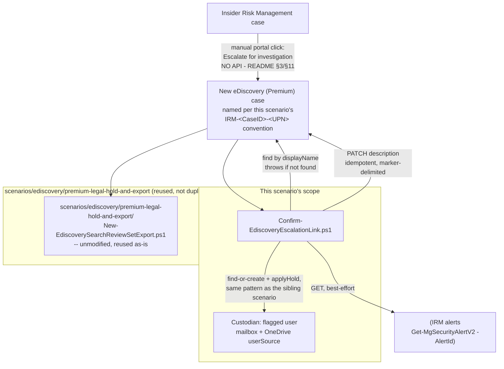

## The short version

Wires Insider Risk Management's manual **"Escalate for investigation"** case action - which opens
a new Microsoft Purview eDiscovery (Premium) case for the flagged user - into this library's
existing eDiscovery (Premium) automation: a documented case-naming convention so the escalated
case is programmatically discoverable, a stamped provenance record linking the eDiscovery case
back to the source IRM case and its alerts (the one thing Microsoft's escalation flow doesn't do
on its own), and a reconciled custodian + mailbox/OneDrive hold for the flagged user.

## Why this matters

Insider risk cases that escalate to legal review are, by definition, the highest-stakes subset of
an Insider Risk Management program - Microsoft's own guidance frames escalation as the step for
when "you need extra legal review for the user's risk activity". Two gaps
specifically matter for a defensible investigation and, later, litigation posture:

- **Preservation must actually happen, promptly, every time.** An escalation that creates an empty
  eDiscovery case - with no custodian added and no hold applied because a human forgot the manual
  follow-up step - creates exactly the kind of preservation gap *Legal Hold, Collection, Review, and Export* (why this matters) already frames as spoliation exposure under FRCP
  Rule 37(e) and the common-law duty to preserve. This scenario removes the "did someone remember
  to finish provisioning the case" dependency on a busy investigator's memory.
- **The evidentiary chain from alert → case → legal hold must be reconstructible later.** An
  auditor, opposing counsel, or a later reviewer asking "why was this eDiscovery case opened, and
  what evidence justified it" should not have to rely on an investigator's memory or a
  Teams/email thread outside Purview - the provenance block this scenario stamps is a durable,
  in-product answer to that question, sourced from fields the v1.0 Graph API actually exposes, not a fabricated linkage.

## How the control works

The escalation click (portal-only, no API - the design notes) is the one step this scenario cannot
automate. Everything after it - provenance linkage and custodian/hold reconciliation - runs
through Microsoft Graph (`microsoft.graph.security` namespace, automation surface 3), the same
surface and auth pattern as *Legal Hold, Collection, Review, and Export*.

## What it takes

### Prerequisites

Full licensing and role detail: [Licensing matrix](/docs/licensing-matrix/) and [RBAC model](/docs/rbac-model/). This scenario
is additive on top of two scenarios this library already covers in full -
*Departing Employee Data Theft* (or any other IRM policy producing cases)
and *Legal Hold, Collection, Review, and Export* - so its own incremental requirements
are narrow:

| Requirement | Minimum | Notes |
|---|---|---|
| Insider Risk Management, with at least one policy producing cases | See *Departing Employee Data Theft* (the prerequisites) | This scenario assumes a case already exists and has been escalated - it does not create IRM policies or cases |
| Role to escalate an IRM case | **Insider Risk Management** or **Insider Risk Management Investigators** role group | The manual portal step this scenario starts after; see [RBAC model, section 4](/docs/rbac-model/#4-purview-role-groups-by-module-representative-not-exhaustive) |
| eDiscovery (Premium) features + role/licensing for custodian/hold automation | Identical to *Legal Hold, Collection, Review, and Export* (the prerequisites) | Same **eDiscovery Manager**/**Administrator** role, same per-custodian E5/add-on licensing requirement |
| Automation identity (case description update, custodian, userSource, hold) | Entra app registration, certificate-based app-only auth, **`eDiscovery.ReadWrite.All`** application permission, registered as an eDiscovery Manager/Administrator service principal | Identical requirement to the sibling scenario - see that scenario's the prerequisites and [Automation surface, section 3](/docs/automation-surface/#3-authentication-patterns---interactive-vs-unattended) for why Graph, not S&C PowerShell, is the only supported app-only path |
| Automation identity (optional alert-title lookup for the provenance block) | The same or a separate app registration, granted **`SecurityAlert.Read.All`** application permission | Only needed if the definition file's `alertIds` array is non-empty; the scenario still functions without it |
| **Gating prerequisite for `-ReleaseHold` in `Remove-EdiscoveryEscalationLink.ps1`** | Written confirmation from counsel that the IRM case's preservation duty has actually lapsed | Identical gate to the sibling scenario's the rollback runbook; releasing a hold placed for an active investigation prematurely can itself be a preservation failure |

### Cost and licensing

No incremental licensing beyond what *Departing Employee Data Theft* and
*Legal Hold, Collection, Review, and Export* already require - this scenario adds no new
Purview feature, only automation gluing two already-licensed capabilities together. See those two
scenarios' the cost and licensing notes for the underlying licensing/PAYG notes (IRM's cloud/GenAI PAYG
processing units; eDiscovery Export API's PAYG metering).

## Proof it works

1. **Automated check** - `./validate/Test-EdiscoveryEscalationLink.ps1 -DefinitionPath ... ...`
   confirms the case exists, the provenance block is present and matches the definition file, the
   custodian and userSource exist, and the hold status; exits non-zero on any hard failure.
2. **Hold propagation** - same 24-hour caveat as the sibling scenario: a non-`success` `HoldStatus`
   immediately after this script runs is reported `WARN`, not `FAIL`; re-run later.
3. **Functional proof (portal)** - open the escalated case in **eDiscovery → Advanced**, confirm
   the **Description** field shows the provenance block, and confirm the custodian's **Hold
   policies** show mailbox + OneDrive as **On**.
4. **Traceability proof** - from the description's `Source Insider Risk Management case: ...`
   line, confirm a reviewer with IRM access can independently locate the originating case by its
   Case ID and cross-check the listed alert IDs against that case's **Alerts** tab.

## Where it stops

- **This scenario cannot trigger the escalation itself, and cannot create the eDiscovery case.**
  There is no Graph/PowerShell API for Insider Risk Management's "Escalate for investigation"
  action - confirmed by its absence from every Graph security API surface this library has
  grounded. `Confirm-EdiscoveryEscalationLink.ps1` throws a clear, actionable error
  naming the missing portal step if the case isn't found, rather than silently doing nothing.
- **The naming convention (`IRM-<Case ID>-<UPN local part>`) is this library's own invention, not a
  Microsoft one.** Nothing in the product enforces it, and a typo or a different investigator's
  different naming habit breaks the lookup silently (the script reports "case not found," which
  could equally mean "not yet escalated" or "escalated under a different name") - this is the
  single biggest operational risk in this scenario and is called out again in the review notes (Red
  Team). A **different**, sharper failure mode - the same case name accidentally reused across two
  *separate* escalations - is guarded against directly: `Confirm-EdiscoveryEscalationLink.ps1`
  throws rather than silently stamping mismatched provenance if the case already carries a block
  for a different IRM case/user, and requires an explicit `-Force` to proceed (which appends,
  never overwrites, so no prior provenance record is lost).
- **VERIFY (pilot tenant):** the exact format of the "Case ID" shown on the Insider Risk
  Management Cases dashboard (numeric, GUID, or another scheme) is not confirmed by Microsoft's
  documentation, which only describes it as "The ID of the case." This scenario treats it as an
  opaque string throughout and never parses or format-validates it.
- **VERIFY (pilot tenant):** whether the portal's "Escalate for investigation" flow automatically
  adds the flagged user as a custodian with a hold applied is not documented either way by
  Microsoft. `Confirm-EdiscoveryEscalationLink.ps1` does not assume an answer - see the design notes
  for why unconditional reconciliation is safe regardless of which way this turns out.
- **The provenance block records alert *titles/severities* at stamp time, not a live link.** If an
  alert is later re-triaged, merged into an incident, or its severity changes, the provenance block
  is not automatically refreshed - re-run `Confirm-EdiscoveryEscalationLink.ps1` (it detects the
  existing block and currently skips re-stamping; see the script's `.NOTES` for the exact
  behavior) or treat the block as a point-in-time record, which is what a defensible provenance
  record should be regardless.
- **This scenario does not resolve, close, or otherwise act on the source Insider Risk Management
  case.** IRM case management has no documented Graph/PowerShell write API - same finding
  *Departing Employee Data Theft* (the configuration reference) already recorded.
- **There is no automatic, event-driven way to fire `Confirm-EdiscoveryEscalationLink.ps1` the
  instant a case is escalated.** Grounded in this build: the Power Automate "For a selected
  Insider Risk Management case" trigger is manually selected by a human from the Cases dashboard,
  not fired by the escalation event itself; the separate Insider Risk
  Management audit log that does record case actions has no documented Graph/REST query endpoint of
  its own and isn't covered by `Search-UnifiedAuditLog`. A scheduled poll of
  this script is therefore the only way to guarantee it always runs unattended.