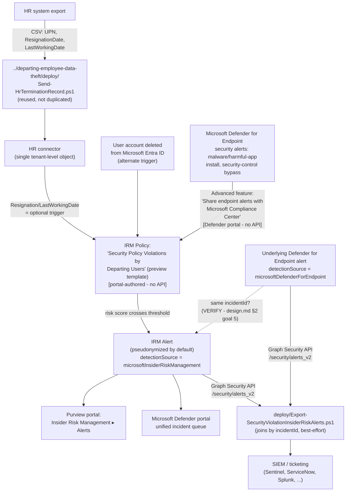

## The short version

> **Preview feature.** Microsoft labels the "Security policy violations" template family - and its
> core Microsoft Defender for Endpoint indicator category - **(preview)** as of this writing
>. Preview features can change or be withdrawn with less
> notice than GA capabilities; re-verify current status before a customer-facing commitment.

Deploys Microsoft Purview Insider Risk Management's **Security policy violations by departing
users** policy template - a sibling of *Departing Employee Data Theft*
that scores the same resignation/termination (or Entra account-deletion) triggering event against
a different signal: **Microsoft Defender for Endpoint security alerts** (malware or other
potentially harmful application installs, disabling device security features) instead of
Microsoft 365 content-activity signals. It reuses the sibling scenario's HR data feed rather than
duplicating it, and ships a Graph-based export script that joins the resulting Insider Risk
Management alert back to the underlying Defender for Endpoint alert that triggered it.

## Why this matters

An employee preparing to leave - especially one with IT, security, or engineering access - has
both motive and opportunity to weaken the endpoint controls protecting company data before they
go: disabling antivirus, installing a remote-access tool to retain access after departure, or
side-loading unsigned software to work around a data-handling restriction. None of that shows up
in an exfiltration-focused control; it shows up as a Defender for Endpoint security alert. This
scenario correlates that alert against employment status the same way its sibling correlates
SharePoint downloads against employment status, supporting the same class of drivers:

- **Endpoint-integrity assurance during offboarding** - closes a specific, common gap in
  standard offboarding checklists: a checklist confirms access was *revoked*, not that the
  *device* wasn't tampered with beforehand.
- **SOC 2 / ISO 27001 termination-control expectations** - the same audit evidence rationale as
  the sibling scenario (*Departing Employee Data Theft* (why this matters)), extended to device
  integrity rather than data handling.
- **Incident-response cost avoidance** - a disabled endpoint control on a soon-to-depart user's
  device is exactly the kind of gap that turns a routine offboarding into a forensic
  investigation if discovered only after the fact.

No regulation names this specific control by requirement number - the same honest framing the
sibling scenario uses (why this matters there).

## How the control works

Full rule-by-rule rationale is in the design notes.

## What it takes

### Prerequisites

Full licensing detail and citations: [Licensing matrix, section 2](/docs/licensing-matrix/#2-master-capability--license-matrix) (Insider Risk Management row).
This scenario adds **one prerequisite the sibling scenario does not have**:

| Requirement | Minimum | Notes |
|---|---|---|
| Insider Risk Management (all policies) | **Microsoft 365 E5/A5/G5**, **Microsoft Purview Suite**, or the **Microsoft 365 E5 Insider Risk Management** add-on | Same base entitlement as every IRM scenario in this library |
| **Microsoft Defender for Endpoint** - active subscription, **Plan 1 is sufficient** | Microsoft's own prerequisite table for this template states only **"Active Microsoft Defender for Endpoint subscription"**, with no Plan 1/Plan 2 qualifier | **Cost-planning note:** a tenant already on full **Microsoft 365 E5** (or **Microsoft 365 E5 Security**) gets **Defender for Endpoint Plan 2** bundled at no incremental cost - but a tenant that reached IRM's E5-equivalent entitlement via the narrower **Microsoft 365 E5 Insider Risk Management** add-on does **not** get Defender for Endpoint for free and must budget for the *minimum* SKU, which this build has confirmed is **Plan 1**: this template scores malware/harmful-app installation via **next-generation protection** and security-control tampering via **tamper protection**, and both capabilities are included in Defender for Endpoint Plan 1 - the Plan 1/Plan 2 feature-comparison table lists Next-generation protection and Attack surface reduction (which tamper protection is part of) as included in **both** plans, while Endpoint detection and response (EDR) is the capability gated to Plan 2 only. Neither indicator this template scores depends on the EDR sensor specifically. *(Resolved 2026-09-27 - previously an open VERIFY; DONE.)* |
| Defender for Endpoint → Purview alert sharing | "Share endpoint alerts with Microsoft Compliance Center" advanced feature, enabled in the Microsoft Defender portal | Portal-only toggle, no documented Graph/PowerShell equivalent - see step 2 of the implementation steps |
| HR data source (optional trigger) | Same HR connector as *Departing Employee Data Theft* - **reused, not a second connector** | If that scenario is already deployed, skip straight to this scenario's step 4 of the implementation steps; Microsoft documents the connector as a single tenant-level object multiple policy templates can consume |
| Role to configure policies/settings | **Insider Risk Management** or **Insider Risk Management Admins** role group | Same as the sibling scenario - [RBAC model, section 4](/docs/rbac-model/#4-purview-role-groups-by-module-representative-not-exhaustive) |
| Role to configure the Defender for Endpoint advanced feature | Microsoft Entra **Security Administrator** (basic permissions), or the granular **Manage security settings in Security Center** permission (legacy Defender for Endpoint RBAC) / **Core security settings (Manage)** permission (Defender unified RBAC) | Different admin surface than Purview RBAC - see [RBAC model, section 12](/docs/rbac-model/#12-microsoft-defender-for-endpoint-portal-rbac---an-eighth-system-for-scenarios-that-configure-defender-for-endpoint-tenant-wide-settings) |
| Automation identity for alert export | App registration with the Microsoft Graph **`SecurityAlert.Read.All`** application permission, certificate-based | Identical to the sibling scenario's export script - the same app registration can be reused |

> Verify current entitlement names against [Licensing matrix](/docs/licensing-matrix/) and the Product Terms
> before a sales commitment - SKU names change, and this template is Microsoft-labeled preview.

### Cost and licensing

- **If the tenant is already on full Microsoft 365 E5 (or E5 Security) for other Purview/IRM
  controls in this library, this scenario adds no incremental license cost** - Defender for
  Endpoint Plan 2 is bundled.
- **If IRM entitlement came from the narrower Microsoft 365 E5 Insider Risk Management add-on
  instead of full E5, Defender for Endpoint is a genuine incremental cost** - budget it
  separately; this is the one licensing difference between this scenario and its sibling that a
  CISO conversation should surface explicitly (the design notes goal 2).
- **No additional cost for the HR connector (reused) or the Graph alert export** - same as the
  sibling scenario.
- **Sizing note:** every user in this policy's scope needs both the qualifying IRM entitlement
  **and** to already be Defender-for-Endpoint-onboarded and licensed - a narrower practical
  population than the sibling scenario's "all users" default in many tenants, since Defender for
  Endpoint device licensing tracks devices/users separately from Purview.

## Proof it works

1. **Automated checks** - `./validate/Test-SecurityViolationIrmSetup.ps1` confirms the Graph
   session and `SecurityAlert.Read.All` permission actually work. Exits non-zero on a hard
   failure.
2. **Manual checklist** - the same script prints a checklist for the portal-only configuration
   (policy existence/template/state, Defender for Endpoint advanced-feature toggle, Intelligent
   detections triage-status selection, role groups) - see the design notes for why these can't be
   automated.
3. **End-to-end functional test (non-production names only, pilot tenant)** - set a near-term
   resignation date for a test account (via the HR CSV or by deleting a disposable test account
   from Microsoft Entra ID), then on a device where that account is signed in and onboarded to
   Defender for Endpoint, trigger a benign Defender for Endpoint detection your test plan already
   uses (e.g., the standard [EICAR test file](https://learn.microsoft.com/defender-endpoint/attack-simulations) or a documented attack simulation) rather than
   actually disabling a security control. Confirm an alert appears in **Insider Risk Management**
   → **Alerts** within the activation window, and that
   `Export-SecurityViolationInsiderRiskAlerts.ps1` retrieves it.
4. **Evidence trail** - the alert's **Activity explorer** tab shows the specific Defender for
   Endpoint alert(s) that contributed to the score.

## Where it stops

- **Preview feature, twice over.** Both the overall "Security policy violations" template family
  and the Defender for Endpoint indicator category it depends on are Microsoft-labeled
  **preview** - re-verify GA status before a customer-facing
  commitment; preview features can change behavior without the notice period Microsoft applies
  to GA changes.
- **No documented Graph/PowerShell surface for the Defender for Endpoint advanced-features
  toggle or for Intelligent detections' triage-status selection.** Both stay portal-only
  prerequisites in this scenario, not fabricated cmdlets - the design notes goal 3.
- **The `incidentId` join in `Export-SecurityViolationInsiderRiskAlerts.ps1` is best-effort, not
  guaranteed.** Microsoft documents general cross-product alert correlation into a shared
  incident and separately documents that IRM alert data reaches the same unified alert queue, but
  no worked example confirming this *specific* pairing (Defender for Endpoint alert →
  Insider-Risk-Management-generated alert) sharing one `incidentId` was found during this build.
  **VERIFY in a pilot tenant.** The script logs a `[WARN]`, not a failure, when no correlated
  alert is found - see the script's own `.NOTES` and the design notes.
- **Cannot disambiguate which "Security policy violations…" template produced a given exported
  alert if more than one is deployed in the same tenant.** The Graph `alert` resource's
  `alertPolicyId` field is populated "when there's a specific policy that generated the alert,"
  but no documented API maps that GUID back to a named Purview policy. the design notes.
- **One Defender for Endpoint alert can produce multiple IRM activity records.** If more than one
  triage status is selected in Intelligent detections, the same underlying alert
  generates a separate activity record per status transition - apply the same
  `Id`-based downstream dedupe guidance the sibling scenario's page the known limitations already documents for
  its own, differently-caused duplicate-export risk.
- **This scenario does not enumerate the exact Microsoft Defender for Endpoint indicator names**
  selectable in the policy workflow - not documented in a bullet list anywhere
  found in Microsoft Learn during this build, unlike the sibling scenario's Office/Device
  indicator lists. Confirm the live portal's options at deploy time.
- **This scenario does not configure the base Security policy violations, …by priority users, or
  …by risky users templates** - each is a candidate follow-up fragment, not bundled here.
  the design notes.
- **This scenario does not configure Adaptive Protection** - same non-goal as the sibling
  scenario (*Departing Employee Data Theft* (the known limitations)).
- **This control is invisible to an offline or physical attack on the endpoint itself.** Every
  indicator this template scores comes from the Defender for Endpoint sensor running on a live,
  online Windows/macOS session. A departing user who boots the device from external media,
  removes the storage drive, or otherwise operates outside the running OS the sensor monitors
  generates **no** alert here - this is a structural limit of an endpoint-sensor-sourced signal
  (next-generation protection and tamper protection, not specifically EDR - see the prerequisites), not a
  configuration gap this scenario can close. Pair with physical/device-encryption controls
  (BitLocker, device-loss procedures) for that risk, not with a tighter Insider Risk Management
  policy.
- **The "Share endpoint alerts with Microsoft Compliance Center" toggle is tenant-wide, not
  per-policy.** Enabling or disabling it affects **every** "Security policy
  violations…" family policy in the tenant simultaneously, including any deployed independently
  of this scenario. An operator troubleshooting or reconfiguring a *different* Defender for
  Endpoint integration could disable this toggle for an unrelated reason and silently stop this
  policy from receiving new alerts - the rollback runbook Stage 2 flags this coupling for intentional
  rollback; it's worth the same attention as an unintended side effect during unrelated Defender
  for Endpoint administration.