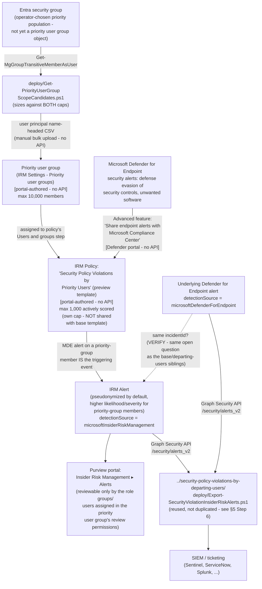

## The short version

> **Preview feature.** Microsoft labels the "Security policy violations" template family - and its
> core Microsoft Defender for Endpoint indicator category - **(preview)** as of this writing
>. Preview features can change or be withdrawn with less
> notice than GA capabilities; re-verify current status before a customer-facing commitment.

Deploys Microsoft Purview Insider Risk Management's **Security policy violations by priority
users** policy template - a sibling of *Security Policy Violations (base template)* (the
base template) that scores the identical triggering event, **Microsoft Defender for Endpoint
security alerts** (malware/harmful-app installs, disabling or bypassing security controls), but
against a materially different population mechanism: a formal, Microsoft-managed **priority user
group** rather than a plain Entra security group. Priority-group membership also increases both
the likelihood and severity of the resulting alerts, and lets an operator restrict who on the
Insider Risk Management team can review that specific population's data - two capabilities the
base template's plain-group mechanism does not offer.

## Why this matters

Some populations warrant a materially different scrutiny level than "everyone with elevated
access" - and a materially tighter circle of reviewers than "every Insider Risk Management
analyst in the tenant." A priority user group is Microsoft's purpose-built object for exactly that
combination:

- **Elevated-scrutiny monitoring for a formally designated population** - a named, auditable
  object (not an ad hoc group repurposed for this one policy) that a security/compliance program
  can point to directly when explaining who receives heightened scoring and why.
- **Reviewer-access minimization for sensitive populations** - restricting review of a specific
  priority group's alerts, cases, and reports to a named subset of role groups or individuals
  supports a genuine least-privilege/need-to-know posture for populations where
  broad IRM-team visibility (e.g., "every analyst can see the CFO's risk score") would itself be a
  privacy or governance concern.
- **SOC 2 / ISO 27001 endpoint-integrity monitoring evidence for a defined high-risk population** -
  the same audit-evidence rationale the base and departing-users sibling scenarios document
  (*Security Policy Violations (base template)* (why this matters)), extended here to a population the organization has
  formally designated as higher-risk rather than one scoped ad hoc for this policy alone.

No regulation names this specific control by requirement number - the same honest framing this
library's other Insider Risk Management scenarios use.

## How the control works

Full rule-by-rule rationale is in the design notes.

## What it takes

### Prerequisites

Full licensing detail and citations: [Licensing matrix, section 2](/docs/licensing-matrix/#2-master-capability--license-matrix) (Insider Risk Management row)
and the validation steps (Defender for Endpoint). This template's prerequisite set matches the base template's
(*Security Policy Violations (base template)* (the prerequisites)) with **one substitution**: a priority user group in
place of a plain Entra group.

| Requirement | Minimum | Notes |
|---|---|---|
| Insider Risk Management (all policies) | **Microsoft 365 E5/A5/G5**, **Microsoft Purview Suite**, or the **Microsoft 365 E5 Insider Risk Management** add-on | Same base entitlement as every IRM scenario in this library |
| **Microsoft Defender for Endpoint** - active subscription | Microsoft's own prerequisite table for this template states only **"Active Microsoft Defender for Endpoint subscription,"** with no Plan 1/Plan 2 qualifier | Same open Plan 1/Plan 2 VERIFY the base and departing-users siblings already carry - not re-litigated here |
| Defender for Endpoint → Purview alert sharing | "Share endpoint alerts with Microsoft Compliance Center" advanced feature, enabled in the Microsoft Defender portal | Portal-only toggle, tenant-wide, shared with every other "Security policy violations…" family policy - step 2 of the implementation steps |
| **Priority user group** - created and populated | Purview portal → Insider Risk Management → Settings → Priority user groups → **Create priority user group**; up to **10,000** members per group | Distinguishing prerequisite versus the base template - see step 3 of the implementation steps/4, the design notes goal 1. No HR connector and no Entra-deletion trigger, same as the base template. |
| Priority user group **reviewer-permission scoping** (recommended for sensitive populations) | Assign one or more of the **Insider Risk Management**, **Insider Risk Management Analysts**, **Insider Risk Management Investigators** role groups, or specific individual users, as the reviewers for this priority user group | Optional but recommended - without it, the group's data remains reviewable by whichever broader IRM role-group membership already applies tenant-wide; operations and tuning |
| Role to configure policies/settings/priority user groups | **Insider Risk Management** or **Insider Risk Management Admins** role group | [RBAC model, section 4](/docs/rbac-model/#4-purview-role-groups-by-module-representative-not-exhaustive) - same role group governs both policy and priority-user-group configuration |
| Role to configure the Defender for Endpoint advanced feature | Microsoft Entra **Security Administrator** (basic permissions), or the granular **Manage security settings in Security Center** permission (legacy Defender for Endpoint RBAC) / **Core security settings (Manage)** permission (Defender unified RBAC) | [RBAC model, section 12](/docs/rbac-model/#12-microsoft-defender-for-endpoint-portal-rbac---an-eighth-system-for-scenarios-that-configure-defender-for-endpoint-tenant-wide-settings) |
| Automation identity for candidate-list resolution | App registration with the Microsoft Graph **`GroupMember.Read.All`** application permission, certificate-based | Used by `deploy/Get-PriorityUserGroupScopeCandidates.ps1` - same permission and pattern as the base template's own scope script; the same app registration can be reused |
| Automation identity for alert export (optional, reused) | App registration with the Microsoft Graph **`SecurityAlert.Read.All`** application permission, certificate-based | Only needed if reusing `../security-policy-violations-by-departing-users/deploy/Export-SecurityViolationInsiderRiskAlerts.ps1` per step 6 of the implementation steps - same identity every sibling in this family already uses |

> Verify current entitlement names against [Licensing matrix](/docs/licensing-matrix/) and the Product Terms before
> a sales commitment - SKU names change, and this template is Microsoft-labeled preview.

### Cost and licensing

- **No incremental license cost beyond the base/departing-users siblings' own baseline** if either
  is already deployed in the tenant - this scenario adds no new licensing tier requirement, only a
  different policy configuration and a priority-user-group object.
- **Sizing note specific to this template:** the 1,000-actively-scored-user cap applies
  cumulatively **across all policies built from this exact template** - Microsoft's Policy
  template limits reference states the limit applies "across all policies using a given policy
  template" and lists each template as its own row in the Limits table. **This cap is its own, independently-tracked pool - confirmed, by a direct
  fetch of that reference, that it is *not* shared with the base "Security policy violations"
  template**, even though both templates happen to document the identical number (1,000). An organization
  already running a base-template policy has full, unreduced headroom for this priority-users
  template, and vice versa - an earlier draft of this note overstated the two caps as shared; that
  has been corrected here ( "DONE" for this fragment). Confirm no *other* policy
  built from this exact "…by priority users" template already exists before sizing a new priority
  user group (manual portal check - no Graph/REST usage-count API exists, same disclosed gap as
  every sibling in this family).
- **No additional cost for the candidate-list resolution or alert-export automation** - both use
  application permissions already covered by the base Microsoft Graph SDK, no metered API.

## Proof it works

1. **Automated checks** - `./validate/Test-PriorityUserGroupIrmSetup.ps1` confirms the Graph
   session and `GroupMember.Read.All` permission actually work (probed against the same group(s)
   used to build the candidate CSV, or any group ID supplied), and reports the resolved count
   against both the 10,000-member and 1,000-actively-scored caps. Exits non-zero on a hard failure.
2. **Manual checklist** - the same script prints a checklist for the portal-only configuration
   (priority user group existence/membership/reviewer-permission scoping, policy
   existence/template/state, Defender for Endpoint advanced-feature toggle, role groups) - see
   the design notes goal 6 for why these can't be automated.
3. **End-to-end functional test (non-production names only, pilot tenant)** - add a disposable test
   account to the priority user group, confirm it appears onboarded to Defender for Endpoint, then
   trigger a benign detection your test plan already uses (e.g., the standard
   [EICAR test file](https://learn.microsoft.com/defender-endpoint/attack-simulations) or a
   documented attack simulation) rather than actually disabling a security control. Confirm an
   alert appears in **Insider Risk Management** → **Alerts** with a severity/likelihood consistent
   with priority-group membership, and that the reused export script retrieves it.
4. **Evidence trail** - the alert's **Activity explorer** tab shows the specific Defender for
   Endpoint alert(s) that contributed to the score.

## Where it stops

- **Preview feature, twice over** - same status as every sibling: both the overall template family
  and the Defender for Endpoint indicator category it depends on are Microsoft-labeled **preview**
  - re-verify GA status before a customer-facing commitment.
- **The interaction between the priority user group's 10,000-member cap and this template's own
  1,000-actively-scored cap is not documented by Microsoft** - a *different*, still-open question
  from whether the 1,000-user cap itself is shared with the base template (it is confirmed **not**
  to be, per sections 6 and 10 and; do not conflate the two). the design notes lays out the
  two plausible readings of the still-open interaction question and confirms neither. Treat a
  priority user group anywhere near 1,000 members as a signal to confirm live portal behavior
  before relying on full coverage - **VERIFY (pilot
  tenant)**.
- **No documented Graph/PowerShell write API for priority user groups.** Creation, membership
  (including the CSV bulk-upload path), and reviewer-permission assignment are all portal-only -
  `deploy/Get-PriorityUserGroupScopeCandidates.ps1` prepares the CSV, it does not upload it, and no
  script in this library can create the priority user group object itself.
- **The exact `user principal name` CSV column-header casing and accepted file format for the
  bulk-upload dialog were not independently confirmed against the live portal during this build**
  (this build's network access could not reach the Microsoft Learn page directly to extract a
  verbatim quote; the value used here is corroborated by multiple independent secondary references
  describing the same Microsoft documentation). **VERIFY against the live upload dialog at deploy
  time** before relying on a script-generated CSV to upload without adjustment.
- **This scenario's "mail-enabled" candidate check is an approximation, not a guarantee.**
  `Get-PriorityUserGroupScopeCandidates.ps1` flags a candidate with no `mail` attribute in Microsoft
  Graph as a `[WARN]`, because Microsoft's own portal workflow describes priority-group members as
  "mail-enabled users" - but a populated `mail` attribute in Microsoft Graph is not itself a
  formal guarantee of Exchange mailbox-enablement. Confirm any flagged candidate resolves correctly
  in the portal's own member-search step before assuming the CSV upload will accept them.
- **A no-`mail` candidate is a `[WARN]`, not an automatic exclusion - do not silently drop these
  users from the priority population without checking who they are first.** A guest account or a
  service/non-interactive account onboarded to Defender for Endpoint (a build server, a privileged
  automation identity) can plausibly lack a populated `mail` attribute while still being exactly
  the kind of elevated-access identity this template exists to watch more closely. If such an
  account genuinely cannot be added to the priority user group (mail-enablement turns out to be a
  hard requirement, per the live portal - step 4 of the implementation steps), treat it as a **disclosed coverage gap** for
  this specific control - pair it with the base template scenario (`security-policy-violations/`),
  which accepts a plain Entra group with no mail-enablement constraint, rather than assuming the
  gap doesn't matter because this scenario's own script only warned instead of failing.
- **`Get-PriorityUserGroupScopeCandidates.ps1` resolves group membership at the moment it runs - it
  is not a live sync**, and its output CSV is a snapshot, not a maintained link to the source Entra
  group. Adding or removing a user from the source group afterward has no effect on either the
  script's prior output or the priority user group's membership until both are explicitly re-run
  and re-uploaded.
- **The 1,000-actively-scored cap has no query API to check current cumulative usage against** -
  same disclosed gap as the base template scenario; Microsoft documents only a portal-visible
  **Users in scope** column on the Policies tab.
- **The `incidentId` join in the reused export script is best-effort, not guaranteed** - see the
  departing-users sibling's own the known limitations and the design notes goal 5/section 5 for the full grounding
  discussion; not re-litigated here since the mechanism is identical.
- **Cannot disambiguate which "Security policy violations…" template produced a given exported
  alert if more than one is deployed in the same tenant** - including this scenario's own policy
  running alongside its base, departing-users, or risky-users siblings.
- **This scenario does not configure the base, …by departing users, or …by risky users templates**
  - each is its own, already-built or separately-scoped fragment, not bundled here.
- **This scenario does not configure Adaptive Protection** - same non-goal as every other Insider
  Risk Management scenario in this library.
- **This control is invisible to an offline or physical attack on the endpoint itself** - same
  structural EDR-sourced-signal limit already documented for every sibling in this family; pair
  with physical/device-encryption controls for that risk, not a tighter IRM policy.
- **The "Share endpoint alerts with Microsoft Compliance Center" toggle is tenant-wide, not
  per-policy** - enabling or disabling it affects every "Security policy violations…" family policy
  in the tenant simultaneously. Same coupling every sibling's the rollback runbook Stage 2 already flags.