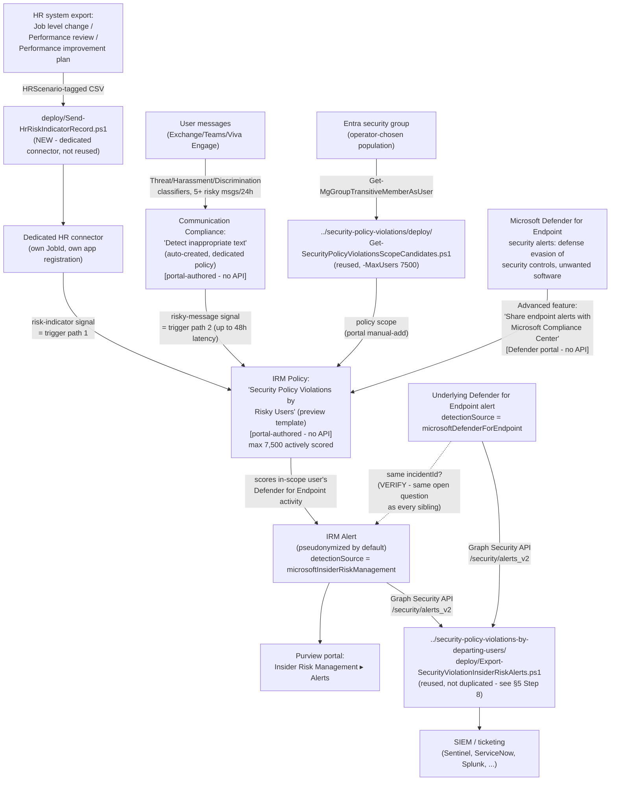

## The short version

> **Preview feature.** Microsoft labels the "Security policy violations" template family - and its
> core Microsoft Defender for Endpoint indicator category - **(preview)** as of this writing
>. Preview features can change or be withdrawn with less
> notice than GA capabilities; re-verify current status before a customer-facing commitment.

Deploys Microsoft Purview Insider Risk Management's **Security policy violations by risky users**
policy template - the fourth and final member of the "Security policy violations…" template family
alongside the already-built base, `…by departing users`, and `…by priority users` scenarios. It
scores the same **Microsoft Defender for Endpoint indicators (preview)** category as every sibling,
but a risky-users population is brought **into scope** by a materially different mechanism: an
**HR-connector-sourced employment-stressor signal** (a performance improvement plan, a poor
performance review, or a job level change) and/or a **Communication Compliance risk-signal
integration** (messages containing potentially threatening, harassing, or discriminatory language)
- at least one is required, and both together is supported. This scenario ships a new,
scenario-specific HR-connector uploader (`deploy/Send-HrRiskIndicatorRecord.ps1`) for the three risk
-indicator HR data types this template needs, none of which the departing-users sibling's
resignation-only uploader can carry.

## Why this matters

Employment stressors are a well-documented behavioral precursor to both inadvertent and malicious
insider activity - Microsoft's own scenario documentation for this template family names
performance improvement plans, poor performance reviews, and job-level changes explicitly. Correlating that stressor signal with a security-control violation on the same
user's device - rather than treating either signal alone - supports:

- **Risk-weighted security-violation triage** - a Defender for Endpoint alert on a user who was
  just placed on a performance improvement plan warrants a different, faster triage priority than
  the identical alert on a user with no such signal. This template makes that correlation a
  first-class trigger instead of something a human analyst has to notice by cross-referencing two
  unrelated systems manually.
- **Early-warning coverage the base template's plain-group scope cannot provide** - the base
  template ([`security-policy-violations/`](../security-policy-violations/)) scores whatever
  population an operator manually assigns; this template scores based on an actual behavioral or
  HR-process signal, closing a detection gap for security-relevant users the base template's static
  group assignment might not include at all.
- **SOC 2 / ISO 27001 endpoint-integrity monitoring evidence for a behaviorally-flagged
  population** - the same audit-evidence rationale this library's other Insider Risk Management
  scenarios document (*Security Policy Violations (base template)* (why this matters)), extended here to a population
  identified by an employment-stressor or risky-communication signal rather than a static
  role-based group.

No regulation names this specific control by requirement number - the same honest framing this
library's other Insider Risk Management scenarios use.

**Governance note, distinct from every other scenario in this library:** this is the only Insider
Risk Management scenario in this library whose triggering signal is drawn directly from **performance-management HR data** (performance improvement plans, poor performance reviews, job-level changes/
demotions) rather than a security-activity signal. Feeding that data into a security-monitoring
trigger - even indirectly, and even though the resulting alert still requires an independent
Defender for Endpoint security-violation signal before anything is scored - is the kind of design
choice that can be perceived as retaliatory or discriminatory if a flagged employee later disputes
a performance action, and may implicate employment-law obligations that are outside this library's
security/compliance scope to assess. **Route this specific trigger path through HR and Legal
review before enabling it in a customer's tenant** - not solely through the Insider Risk Management
or security team that would normally own this kind of control. This is a deployment-governance
recommendation, not a technical limitation; operations and tuning restates it as an operational item.

## How the control works

Full rule-by-rule rationale is in the design notes.

## What it takes

### Prerequisites

Full licensing detail and citations: [Licensing matrix, section 2](/docs/licensing-matrix/#2-master-capability--license-matrix) (Insider Risk Management and
Communication Compliance rows) and the validation steps (Defender for Endpoint). This template's prerequisite set is
the **most complex in the family** - it is the only member with a genuine **AND/OR** shape (one of
two trigger paths, both requiring a shared Defender for Endpoint prerequisite):

| Requirement | Minimum | Notes |
|---|---|---|
| Insider Risk Management (all policies) | **Microsoft 365 E5/A5/G5**, **Microsoft Purview Suite**, or the **Microsoft 365 E5 Insider Risk Management** add-on | Same base entitlement as every IRM scenario in this library |
| **Microsoft 365 HR connector** - configured for risk indicators, **OR** | Job level change, Performance review, and/or Performance improvement plan CSV data type(s) | At least one of this row or the Communication Compliance row below is required; both together is supported and recommended - step 5 of the implementation steps |
| **Communication Compliance risk-signal integration** - dedicated risky-user policy | Selected as an option in the IRM policy-creation workflow itself | Auto-creates a dedicated "Detect inappropriate text" Communication Compliance policy - portal-only, no PowerShell surface for Communication Compliance policy authoring exists; step 6 of the implementation steps |
| **Microsoft Defender for Endpoint** - active subscription | Microsoft's own prerequisite table for this template states only **"Active Microsoft Defender for Endpoint subscription,"** with no Plan 1/Plan 2 qualifier | Required **regardless of which trigger path above is used** - same open Plan 1/Plan 2 VERIFY the base/departing-users/priority-users siblings already carry |
| Defender for Endpoint → Purview alert sharing | "Share endpoint alerts with Microsoft Compliance Center" advanced feature, enabled in the Microsoft Defender portal | Portal-only toggle, tenant-wide, shared with every other "Security policy violations…" family policy - step 3 of the implementation steps |
| Role to configure policies/settings | **Insider Risk Management** or **Insider Risk Management Admins** role group | [RBAC model, section 4](/docs/rbac-model/#4-purview-role-groups-by-module-representative-not-exhaustive) |
| Role to configure the Defender for Endpoint advanced feature | Microsoft Entra **Security Administrator** (basic permissions), or the granular **Manage security settings in Security Center** permission (legacy Defender for Endpoint RBAC) / **Core security settings (Manage)** permission (Defender unified RBAC) | [RBAC model, section 12](/docs/rbac-model/#12-microsoft-defender-for-endpoint-portal-rbac---an-eighth-system-for-scenarios-that-configure-defender-for-endpoint-tenant-wide-settings) |
| Role to create the HR connector | **Data Connector Admin** (or a role group that includes it) | [RBAC model, section 4](/docs/rbac-model/#4-purview-role-groups-by-module-representative-not-exhaustive); distinct from the IRM policy-configuration role above |
| Automation identity for scope-candidate resolution (reused) | App registration with the Microsoft Graph **`GroupMember.Read.All`** application permission, certificate-based | Reused unmodified from the base template - step 4 of the implementation steps |
| Automation identity for HR-connector upload (new, dedicated) | Microsoft Entra app registration created via `../security-policy-violations-by-departing-users/../departing-employee-data-theft/deploy/Register-HrConnectorApp.ps1` (reused unmodified, different `-DisplayName`) - no Graph API permission granted, single-purpose against the HR-connector webhook only | step 2 of the implementation steps; **not** the departing-employee-data-theft sibling's own app/connector - see the design notes |
| Automation identity for alert export (optional, reused) | App registration with the Microsoft Graph **`SecurityAlert.Read.All`** application permission, certificate-based | Only needed if reusing `../security-policy-violations-by-departing-users/deploy/Export-SecurityViolationInsiderRiskAlerts.ps1` per step 8 of the implementation steps |

> Verify current entitlement names against [Licensing matrix](/docs/licensing-matrix/) and the Product Terms before
> a sales commitment - SKU names change, and this template is Microsoft-labeled preview.

### Cost and licensing

- **No incremental license cost beyond the base/departing-users/priority-users siblings' own
  baseline** for the IRM and Defender for Endpoint entitlements if any sibling is already deployed
  in the tenant - this scenario adds no new licensing *tier* requirement for those two products.
- **Communication Compliance licensing, if that trigger path is used:** Communication Compliance
  itself requires the same class of entitlement as Insider Risk Management (E5/A5/G5, Purview
  Suite, or an E5 add-on) per [Licensing matrix, section 2](/docs/licensing-matrix/#2-master-capability--license-matrix) - confirm this entitlement is present
  independently of IRM's own if Communication Compliance was not otherwise already in use in the
  tenant; the two are covered by the same top-tier bundles but are separate line items on a
  narrower add-on-based entitlement.
- **Sizing note specific to this template:** the 7,500-actively-scored-user cap applies cumulatively
  **across all policies built from this exact template** - confirm no other policy sharing this
  cap already exists before sizing a new population (manual portal check - no Graph/REST usage-count
  API exists, same disclosed gap as every sibling).
- **No additional cost for the scope-candidate resolution, HR-connector upload, or alert-export
  automation** - all use application permissions already covered by the base Microsoft Graph SDK or
  the HR-connector's own OAuth flow, no metered API.

## Proof it works

1. **Automated checks** - `./validate/Test-RiskyUsersIrmSetup.ps1` confirms the Graph session and
   `GroupMember.Read.All` permission actually work (probed against the same group(s) used for
   scoping), and reports the resolved count against the 7,500-user cap. Exits non-zero on a hard
   failure.
2. **Manual checklist** - the same script prints a checklist for the portal-only configuration (HR
   connector existence/scenario mapping, Communication Compliance dedicated policy existence, policy
   existence/template/state, Defender for Endpoint advanced-feature toggle, role groups) - see
   the design notes for why these can't be automated.
3. **End-to-end functional test (non-production names only, pilot tenant)** - upload a single
   disposable test record via `Send-HrRiskIndicatorRecord.ps1 -WhatIf:$false` for a test account
   already onboarded to Defender for Endpoint, then trigger a benign detection your test plan
   already uses (e.g., the standard
   [EICAR test file](https://learn.microsoft.com/defender-endpoint/attack-simulations) or a
   documented attack simulation) rather than actually disabling a security control. Confirm an alert
   appears in **Insider Risk Management** → **Alerts**, and that the reused export script retrieves it. Repeat separately for the Communication Compliance trigger path if it is
   also enabled (send 5+ test messages matching a risky classifier within 24 hours from a
   disposable test account, per the configuration reference's documented threshold).
4. **Evidence trail** - the alert's **Activity explorer** tab shows the specific Defender for
   Endpoint alert(s) that contributed to the score.

## Where it stops

- **Preview feature, twice over** - same status as every sibling: both the overall template family
  and the Defender for Endpoint indicator category it depends on are Microsoft-labeled **preview**
  - re-verify GA status before a customer-facing commitment.
- **This scenario provisions a second, dedicated HR connector rather than reusing the
  departing-employee-data-theft sibling's connector - VERIFY whether the live portal actually
  supports adding new HR scenarios to an existing connector via Edit before assuming a second
  connector is strictly required.** Microsoft's own documentation describes the Edit action as
  changing "the Azure App ID or the column header names," not as adding scenarios a connector wasn't
  originally created with - the design notes.
- **Documented Microsoft-side inconsistency in the Performance improvement plan CSV column
  reference.** Microsoft's own worked example shows the header
  `UserPrincipalName,EffectiveDate,ImprovementRemarks,PerformanceRating`, but the column-description
  table immediately below it labels the same optional columns "Remarks" and "Rating" - identical
  wording to the separate Performance review section, apparently not updated for this one. Because
  Microsoft's own text states column names are examples mapped at connector-creation time (not a
  fixed contract), this does not block `Send-HrRiskIndicatorRecord.ps1` (which validates only
  `UserPrincipalName`/`EffectiveDate`/the scenario column), but confirm the actual expected column
  names against the live portal's file-mapping step rather than assuming either worked example is
  authoritative.
- **Microsoft's own documentation uses two different names for the Communication Compliance
  auto-created dedicated policy within the same article** - "Insider risk trigger - (date created)"
  in one paragraph, "Risky user in messages - (date created)" in the next. Disclosed as an
  unresolved documentation inconsistency, not resolved by guessing which is correct - confirm the
  actual name against the live portal at deploy time.
- **No documented Graph/PowerShell write (or read) API for Communication Compliance policy
  configuration.** Creation (even the auto-created dedicated policy), editing scope/conditions, and
  reviewer-permission assignment are all portal-only - Microsoft states this explicitly.
- **The HR-connector re-ingestion/de-duplication behavior for an unchanged row re-uploaded on a
  later scheduled run is not documented by Microsoft** - identical open gap to the
  departing-employee-data-theft sibling's own resignation uploader. **VERIFY (pilot tenant).**
- **This scenario's "at least one trigger required" prerequisite is a genuine AND/OR, not
  optional-vs-optional like the departing-users sibling's two triggers** - a policy created with
  *neither* the HR connector nor Communication Compliance integration actually producing signal is
  possible at creation time but does not satisfy Microsoft's own documented prerequisite; treat this
  as a configuration error to catch at deployment sign-off, not a supported "no trigger" state.
- **The Communication Compliance trigger path has a documented, fixed threshold (5+ risky messages
  within 24 hours) that a disciplined insider aware of this control can deliberately stay under.**
  Microsoft's own documentation states this exact count - an attacker who limits
  themselves to at most 4 threatening/harassing/discriminatory messages per rolling 24-hour window
  generates no Communication Compliance signal at all, and if that same user also has no qualifying
  HR risk-indicator record, never enters this policy's scope regardless of how severe an individual
  message is. This is a structural property of a documented, count-based threshold Microsoft
  controls, not a configuration gap this scenario can close - pair with the base template's plain-group scope (which has no message-count gate at all) for a population where this specific evasion
  is a live concern.
- **The `incidentId` join in the reused export script is best-effort, not guaranteed** - see the
  departing-users sibling's own the known limitations and the design notes goal 5/section 5 for the full grounding
  discussion; not re-litigated here since the mechanism is identical.
- **The 7,500-actively-scored cap has no query API to check current cumulative usage against** -
  same disclosed gap as every sibling; Microsoft documents only a portal-visible **Users in scope**
  column on the Policies tab.
- **Cannot disambiguate which "Security policy violations…" template produced a given exported alert
  if more than one is deployed in the same tenant** - including this scenario's own policy running
  alongside its base, departing-users, or priority-users siblings.
- **This scenario does not configure the base, …by departing users, or …by priority users
  templates** - each is its own, already-built, separately-scoped fragment.
- **This scenario does not configure Adaptive Protection** - same non-goal as every other Insider
  Risk Management scenario in this library.
- **This control is invisible to an offline or physical attack on the endpoint itself** - same
  structural EDR-sourced-signal limit already documented for every sibling in this family.
- **The "Share endpoint alerts with Microsoft Compliance Center" toggle is tenant-wide, not
  per-policy** - enabling or disabling it affects every "Security policy violations…" family policy
  in the tenant simultaneously. Same coupling every sibling's the rollback runbook Stage 2 already flags.