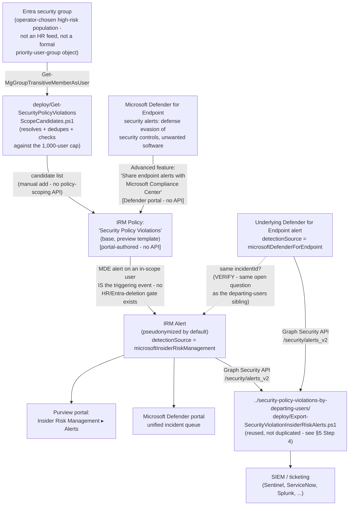

## The short version

> **Preview feature.** Microsoft groups this template with its departing-users, priority-users, and
> risky-users siblings under the "Intentional or unintentional security policy violations
> **(preview)**" scenario heading. Preview features can change or be withdrawn
> with less notice than GA capabilities; re-verify current status before a customer-facing
> commitment.

Deploys Microsoft Purview Insider Risk Management's **Security policy violations** policy
template - the base member of the same template family as
*Security Policy Violations by Departing Users*, but with a materially
different scoping model: **no HR/departure trigger and no priority-user-group requirement.** Its
own triggering event *is* the security signal itself - "Defense evasion of security controls or
unwanted software detected by Microsoft Defender for Endpoint" - so any
in-scope, Defender-for-Endpoint-onboarded user starts being scored the moment their device
generates a qualifying alert, with no employment-status or priority-group gate in front of it.

## Why this matters

Not every population an organization wants to watch for security-control tampering fits the
departing-users or priority-users templates' specific gating mechanisms. A contractor pool on
managed devices, a DevOps team with standing local-admin rights, or a help-desk group with elevated
troubleshooting permissions may never appear in an HR resignation feed and may not warrant the
administrative overhead of a formal priority-user-group definition - but disabling endpoint
security controls or installing unapproved software is exactly as risky coming from any of them as
from a departing employee. This scenario supports:

- **Continuous, always-on coverage for a defined high-risk population**, independent of employment
  status or a separately maintained priority-group object - the population is scoped once, at
  policy-creation time, by whoever selects the users/groups in the policy's "Users and groups"
  step.
- **SOC 2 / ISO 27001 endpoint-integrity monitoring evidence** - the same audit-evidence rationale
  the sibling scenario documents (*Security Policy Violations by Departing Users* (why this matters)),
  extended to a population defined by role or access level rather than departure status.
- **A lower-administrative-overhead alternative to the priority-users template** for a tenant that
  wants a bounded, high-risk population watched but doesn't want to build and maintain a formal
  **priority user group** object in Insider Risk Management settings ([RBAC model, section 4](/docs/rbac-model/#4-purview-role-groups-by-module-representative-not-exhaustive);
  `insider-risk-management-settings-priority-user-groups`) - a plain Entra security group, resolved
  by this scenario's own `deploy/Get-SecurityPolicyViolationsScopeCandidates.ps1`, is enough.

No regulation names this specific control by requirement number - the same honest framing this
library's other Insider Risk Management scenarios use (e.g.
*Security Policy Violations by Departing Users* (why this matters)).

## How the control works

Full rule-by-rule rationale is in the design notes.

## What it takes

### Prerequisites

Full licensing detail and citations: [Licensing matrix, section 2](/docs/licensing-matrix/#2-master-capability--license-matrix) (Insider Risk Management row)
and the validation steps (Defender for Endpoint). This template's prerequisite set is a strict subset of the
departing-users sibling's - **no HR connector, no Entra-deletion trigger configuration, and no
priority user group** are required or even applicable:

| Requirement | Minimum | Notes |
|---|---|---|
| Insider Risk Management (all policies) | **Microsoft 365 E5/A5/G5**, **Microsoft Purview Suite**, or the **Microsoft 365 E5 Insider Risk Management** add-on | Same base entitlement as every IRM scenario in this library |
| **Microsoft Defender for Endpoint** - active subscription | Microsoft's own prerequisite table for this template states only **"Active Microsoft Defender for Endpoint subscription,"** with no Plan 1/Plan 2 qualifier | Same open Plan 1/Plan 2 VERIFY the departing-users sibling already carries - see that scenario's the prerequisites and the known limitations; not re-litigated here |
| Defender for Endpoint → Purview alert sharing | "Share endpoint alerts with Microsoft Compliance Center" advanced feature, enabled in the Microsoft Defender portal | Portal-only toggle, no documented Graph/PowerShell equivalent - identical mechanism to the sibling scenario's step 2 of the implementation steps |
| Role to configure policies/settings | **Insider Risk Management** or **Insider Risk Management Admins** role group | [RBAC model, section 4](/docs/rbac-model/#4-purview-role-groups-by-module-representative-not-exhaustive) |
| Role to configure the Defender for Endpoint advanced feature | Microsoft Entra **Security Administrator** (basic permissions), or the granular **Manage security settings in Security Center** permission (legacy Defender for Endpoint RBAC) / **Core security settings (Manage)** permission (Defender unified RBAC) | [RBAC model, section 12](/docs/rbac-model/#12-microsoft-defender-for-endpoint-portal-rbac---an-eighth-system-for-scenarios-that-configure-defender-for-endpoint-tenant-wide-settings) |
| Automation identity for scope resolution | App registration with the Microsoft Graph **`GroupMember.Read.All`** application permission, certificate-based | Used by `deploy/Get-SecurityPolicyViolationsScopeCandidates.ps1` - a different permission than the sibling's alert-export identity, but the same app-only certificate pattern ([Automation surface, section 3](/docs/automation-surface/#3-authentication-patterns---interactive-vs-unattended)) |
| Automation identity for alert export (optional, reused) | App registration with the Microsoft Graph **`SecurityAlert.Read.All`** application permission, certificate-based | Only needed if reusing `../security-policy-violations-by-departing-users/deploy/Export-SecurityViolationInsiderRiskAlerts.ps1` per step 4 of the implementation steps below - same identity that scenario already uses can be reused here too |

> Verify current entitlement names against [Licensing matrix](/docs/licensing-matrix/) and the Product Terms before
> a sales commitment - SKU names change, and this template is Microsoft-labeled preview.

### Cost and licensing

- **No incremental license cost beyond the departing-users sibling's own baseline** if that
  scenario (or any other Defender-for-Endpoint-dependent Purview control) is already deployed in
  the tenant - this scenario adds no new licensing tier requirement, only a different policy
  configuration.
- **Sizing note specific to this template:** because the 1,000-user cap applies **across all
  policies built from this exact template** in the tenant, an organization already running a "Security
  policy violations" (base) policy elsewhere - e.g., from a prior, undocumented deployment - has
  less headroom than this scenario's own step 3 of the implementation steps sizing check alone would suggest. Confirm no
  other base-template policy already exists before sizing a new population (manual portal check -
  no Graph/REST usage-count API exists, per step 3 of the implementation steps).
- **No additional cost for the scope-resolution or alert-export automation** - both use
  application permissions already covered by the base Microsoft Graph SDK, no metered API.

## Proof it works

1. **Automated checks** - `./validate/Test-SecurityPolicyViolationsIrmSetup.ps1` confirms the
   Graph session and `GroupMember.Read.All` permission actually work (probed against the same
   group(s) used for scoping, or any group ID supplied), and separately confirms
   `SecurityAlert.Read.All` if an alert-export smoke test is requested. Exits non-zero on a hard
   failure.
2. **Manual checklist** - the same script prints a checklist for the portal-only configuration
   (policy existence/template/state, Defender for Endpoint advanced-feature toggle, role groups,
   in-scope user count against the 1,000 cap) - see the design notes for why these can't be
   automated.
3. **End-to-end functional test (non-production names only, pilot tenant)** - add a disposable test
   account to the scoped population's Entra group, confirm it appears onboarded to Defender for
   Endpoint, then trigger a benign detection your test plan already uses (e.g., the standard
   [EICAR test file](https://learn.microsoft.com/defender-endpoint/attack-simulations) or a
   documented attack simulation) rather than actually disabling a security control. Confirm an
   alert appears in **Insider Risk Management** → **Alerts** and that the reused export script
 retrieves it.
4. **Evidence trail** - the alert's **Activity explorer** tab shows the specific Defender for
   Endpoint alert(s) that contributed to the score.

## Where it stops

- **Preview feature, twice over** - same status as the departing-users sibling: both the overall
  template family and the Defender for Endpoint indicator category it depends on are
  Microsoft-labeled **preview** - re-verify GA status before a
  customer-facing commitment.
- **The 1,000-user template-wide cap has no query API to check current usage against.** Neither
  `Get-SecurityPolicyViolationsScopeCandidates.ps1` nor any other script in this library can confirm
  how many users are already in scope of other policies sharing this template - Microsoft
  documents only a portal-visible **Users in scope** column on the Policies tab. This is a genuine, disclosed gap, not a fabricated workaround.
- **"Scores every onboarded user continuously" (the framing this fragment's originating backlog
  item used) is not an accurate operating model at enterprise scale.** The 1,000-user cap makes a
  tenant-wide "all users" scope infeasible for any organization above roughly that headcount -
  the design notes documents this correction explicitly; this scenario deliberately recommends a
  bounded, role-based population instead.
- **No documented Graph/PowerShell surface for the Defender for Endpoint advanced-features toggle**
  - same portal-only boundary as the sibling scenario; not fabricated here either.
- **The `incidentId` join in the reused export script is best-effort, not guaranteed** - see the
  sibling scenario's own the known limitations and the design notes goal 5/section 5 for the full grounding
  discussion; not re-litigated here since the mechanism is identical.
- **Cannot disambiguate which "Security policy violations…" template produced a given exported
  alert if more than one is deployed in the same tenant** - including this scenario's own base
  template running alongside its departing-users, priority-users, or risky-users siblings. Same
  disclosed gap as the sibling scenario (the design notes there).
- **This scenario does not configure the …by priority users or …by risky users templates** -
  each is its own candidate follow-up fragment with a materially different scoping model, not
  bundled here. the design notes.
- **This scenario does not configure Adaptive Protection** - same non-goal as every other Insider
  Risk Management scenario in this library.
- **This control is invisible to an offline or physical attack on the endpoint itself** - same
  structural EDR-sourced-signal limit already documented for the departing-users sibling
  (*Security Policy Violations by Departing Users* (the known limitations)); pair with physical/
  device-encryption controls for that risk, not a tighter IRM policy.
- **The "Share endpoint alerts with Microsoft Compliance Center" toggle is tenant-wide, not
  per-policy** - enabling or disabling it affects every "Security policy violations…" family
  policy in the tenant simultaneously, including this scenario's own policy and any others deployed
  independently of it. Same coupling the sibling scenario's the rollback runbook Stage 2 already flags.
- **`Get-SecurityPolicyViolationsScopeCandidates.ps1` resolves group membership at the moment it
  runs - it is not a live sync.** Adding or removing a user from the source Entra group afterward
  has no effect on this script's own output until it's re-run.
- **Whether the IRM policy scope itself stays in sync with the source group's future membership
  changes (if the group was added directly, step 4 of the implementation steps) is not clearly documented by Microsoft
  either way** - a genuinely open question, not just a limitation of this scenario's own tooling.
  Treat both possibilities as live: **VERIFY (pilot tenant)** before assuming either dynamic
  following or a static snapshot, and re-run this scenario's scope-sizing script and manually
  re-confirm the portal scope on the same periodic cadence regardless - that guidance holds
  whichever way this resolves.