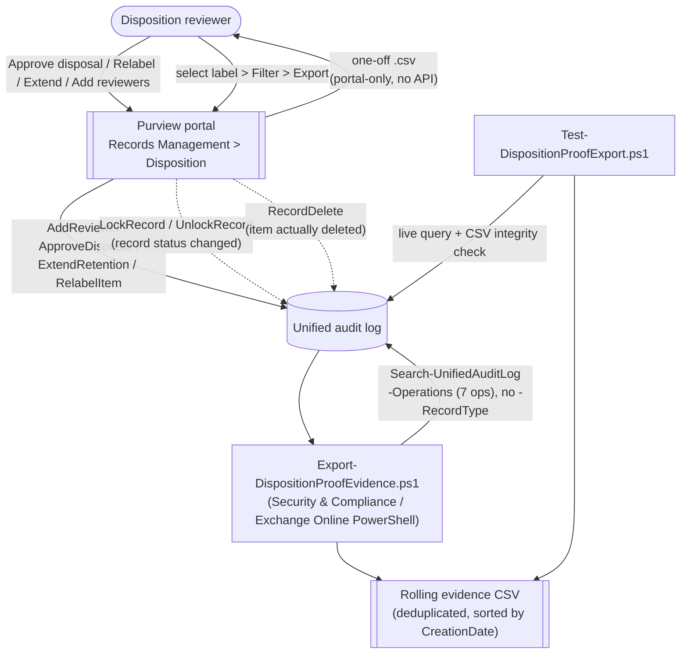

## The short version

Closes the "how do you prove it" question every disposition-ending records-management scenario in
this library leaves at the portal's door. Documents the Microsoft-native **Disposition** page Filter +
Export workflow (the primary, portal-only "proof of disposition" mechanism), and adds a scriptable,
schedulable companion - `Export-DispositionProofEvidence.ps1` - that builds a rolling, deduplicated
audit trail of every disposition-review reviewer action and every record deletion, tenant-wide or
scoped to one retention label.

**Companion to:** *Event-Based Records Disposition with Disposition Review* (whose this page
Section 7 references this scenario for the evidence loop) and
*Multi-Stage Disposition Review Panel* - both scenarios produce the
disposition activity this scenario reports on; neither creates or configures anything itself.

## Why this matters

Retention schedules only satisfy **DoD 5015.02**, **SEC 17a-4 / FINRA 4511**, **GDPR/CCPA**
storage-limitation, and internal records policies if disposal can be **proven**, not just asserted.
Microsoft's own guidance is explicit that disposition "uses information from the unified audit log"
and requires auditing to be enabled before the fact - the audit trail is not
optional tooling here, it is the evidentiary record itself. An examiner asking "show me that this
record class was disposed of on schedule, with the required sign-off" is asking for exactly the two
things this scenario produces: the portal's own per-label export, and a rolling, tenant-wide
automation trail that survives beyond any single manual pull.

## How the control works

Two independent, complementary evidence paths off the same audit log: the portal's manual per-label
`.csv` (the implementation steps, Portal reference), and this scenario's scriptable, tenant-wide rolling trail. Full
rationale: the design notes.

## What it takes

### Prerequisites

Full licensing detail: [Licensing matrix](/docs/licensing-matrix/) Section 2. RBAC: [RBAC model](/docs/rbac-model/). Automation
surface: [Automation surface](/docs/automation-surface/) (surface 3 - Exchange Online PowerShell,
`Search-UnifiedAuditLog`). Summary:

| Requirement | Minimum | Notes |
|---|---|---|
| Licensing | **Records management** (disposition review, record labels): **M365 E5 / E5 Compliance / Purview Suite** | Same tier as the parent disposition scenarios |
| Licensing | **Audit (Standard)**, included in most Microsoft 365/Office 365 plans; **Audit (Premium)** optional for longer retention | See sections 8 and 10 for retention-tier implications |
| Role (portal Disposition page) | **Disposition Management** role (Records Management role group; not granted to global admins by default) | Governs who can view/act on items in the portal - [RBAC model, section 4](/docs/rbac-model/#4-purview-role-groups-by-module-representative-not-exhaustive) |
| Role (this scenario's export script) | **View-Only Audit Logs** or **Audit Logs** Exchange Online role | `Search-UnifiedAuditLog` is an Exchange Online cmdlet, not a Purview role group - [RBAC model, section 6](/docs/rbac-model/#6-exchange-online-dependency-the-most-common-permissions-gap). **Deliberately a different role than Disposition Management** - the design notes item 5 |
| Auth | `Connect-ExchangeOnline` (certificate app-only preferred) | [Automation surface, section 3](/docs/automation-surface/#3-authentication-patterns---interactive-vs-unattended) |
| Auditing | Enabled **at least one day** before the first disposition action | Required for the events this scenario queries to exist at all |

> Verify current entitlement names against [Licensing matrix](/docs/licensing-matrix/) (dated 2026-09-02) before a
> sales commitment - SKU names change.

### Cost and licensing

- **No separate meter.** Records Management and Audit (Standard) are per-user E5-tier entitlements
  already assumed by the parent disposition scenarios; this scenario adds no new
  licensing requirement on top of them.
- **The real cost driver is audit-retention tier**, not this scenario's script. If an evidentiary
  window longer than 180 days (Standard) or 1 year (E5 default for Exchange/SharePoint/OneDrive/
  Entra ID) is required, **Audit (Premium)** - and its separate 10-year retention add-on - is the
  licensed way to extend it; this scenario's rolling CSV is a mitigation for tenants without Premium,
  not a substitute for it if the compliance requirement genuinely needs multi-year raw audit access.
- **Storage cost of the CSV itself** is negligible at typical disposition-event volumes, but scales
  with tenant size and label count if run tenant-wide over long history.

## Proof it works

1. **Automated (live query)** - `./validate/Test-DispositionProofExport.ps1` searches the same seven
   Operations and reports counts per Operation, most-recent-event details, and an explicit
   `[INCONCLUSIVE]` (never `[FAIL]`) note on a zero-row window.
2. **Automated (CSV integrity)** - `./validate/Test-DispositionProofExport.ps1 -CsvPath <path>`
   additionally checks the rolling CSV's structural integrity: non-empty and non-duplicate
   `CompositeKey` values, parseable `CreationDate` on every row, and ascending sort order. These ARE
   `[PASS]`/`[FAIL]` checks - they validate this scenario's own deterministic output, not tenant
   activity.
3. **Idempotency proof** - re-run `deploy/Export-DispositionProofEvidence.ps1` for the same window;
   the "new, non-duplicate record(s) to merge" count is `0` and the CSV is byte-for-byte unchanged in
   row count.
4. **Cross-check against the portal** - for one label, compare the script's `RecordDelete`/
   `ApproveDisposal` counts against the portal's own Filter+Export `.csv` for the same label and time
   range (the implementation steps, Portal path). They report the same underlying audit events through two different
   surfaces, so counts should reconcile once you account for the portal's per-label scoping versus
   this script's tenant-wide default.

## Where it stops

- **The rolling CSV is not itself tamper-evident.** Composite-key de-duplication prevents *accidental*
  duplicate rows across overlapping scheduled runs; it is not an integrity or signing mechanism. An
  identity with write access to `-OutputCsvPath` could edit or delete rows without detection by this
  scenario's own tooling. If this evidence needs to hold up as genuine "proof" for an examiner or in
  litigation, write it to storage with its own tamper-evidence (an immutable/WORM-configured Azure
  Storage container, or a source-control repository with signed commits and restricted write access)
  - not a general-purpose file share. This is a CISO-level consideration, not a cosmetic detail: the
  entire value of this scenario is undermined if the evidence artifact itself has a weaker chain of
  custody than the records it documents.
- **Microsoft recommends the Office 365 Management Activity API over `Search-UnifiedAuditLog` for
  production automation** ("If you want to programmatically download data from the Microsoft 365
  audit log, we recommend that you use the Microsoft 365 Management Activity API instead of using the
  Search-UnifiedAuditLog cmdlet in a PowerShell script"). This scenario uses
  `Search-UnifiedAuditLog`, matching every other audit-trail script in this library, because it needs
  no separate app-only Management API subscription/webhook setup for a scheduled pull-based script -
  but for continuous, near-real-time, high-volume streaming, *Continuous Streaming to a SIEM (Sentinel Connector + Management Activity API)* is the Microsoft-recommended path and should be preferred
  at that scale.
- **No `RecordType` filter for these seven Operations - confirmed correct, not just unconfirmed
  (closed 2026-09-26).** `RecordsManagement` and `MultiStageDisposition` are both real, documented
  members of Microsoft Graph's `auditLogRecordType` enum and plausible candidates
  by name, but they are members of that Graph-only enum, not of the Office 365 Management Activity
  API schema's `AuditLogRecordType` enum that `Search-UnifiedAuditLog`'s own `-RecordType`
  parameter documentation points to as its value source - a full-page fetch of that schema page
  found neither name anywhere on it. Neither value is valid `-RecordType` input for this cmdlet, so
  omitting `-RecordType` here is the only correct choice, independent of the separate
  `RecordDelete` SharePoint-vs.-Exchange table ambiguity - the design notes item 3.
- **VERIFY (pilot tenant): manual vs. autoapproved `ApproveDisposal`.** Microsoft states
  autoapproval reuses the same event rather than emitting a new one, without naming the
  distinguishing `AuditData` field. The raw `AuditData` JSON is preserved in every exported row so
  this can be extracted later once the field is identified, without a re-query.
- **VERIFY (pilot tenant): the `AuditData` property name for the retention label.** `-RetentionLabelName`
  performs a best-effort scan of every top-level string property on the parsed `AuditData` object
  rather than asserting a specific property name - no worked example was found confirming one for
  these Operations.
- **The portal's Filter+Export `.csv` cannot be scripted.** No documented PowerShell cmdlet or Graph
  endpoint reproduces it (the design notes item 4); the only `disposition*`-named Graph resource found,
  `dispositionReviewStage`, models a label's stage/reviewer configuration, not a live disposition
  item or its outcome. This scenario's script is a complement, covering the same
  underlying audit events through a schedulable path, not a drop-in replacement for the portal
  workflow.
- **A zero-row result is not proof nothing was disposed.** It's equally consistent with no label
  having reached end-of-retention yet, a review-free label with nothing pending, or auditing enabled
  too recently to have captured the activity in question. The validate script reports this as
  `[INCONCLUSIVE]`, never `[FAIL]`.
- **Disposition Management and the export script's Audit Logs role are deliberately separate.** An
  identity with only one of the two cannot do the other's job - see the prerequisites and the design notes item 5.
- **Scope matches the portal's own**: "A disposition review can include content in Exchange
  mailboxes, SharePoint sites, and OneDrive accounts" - Microsoft Teams messages
  are not a disposition-review location, so this scenario's evidence trail inherits that same scope
  boundary, not a gap this scenario introduces.
- **Audit-retention tier limits what history is even reachable** - see sections 8 and 10. This scenario cannot
  retrieve evidence for events that have already aged out of the tenant's configured retention
  window; schedule proactively, don't rely on a retroactive pull for old activity.