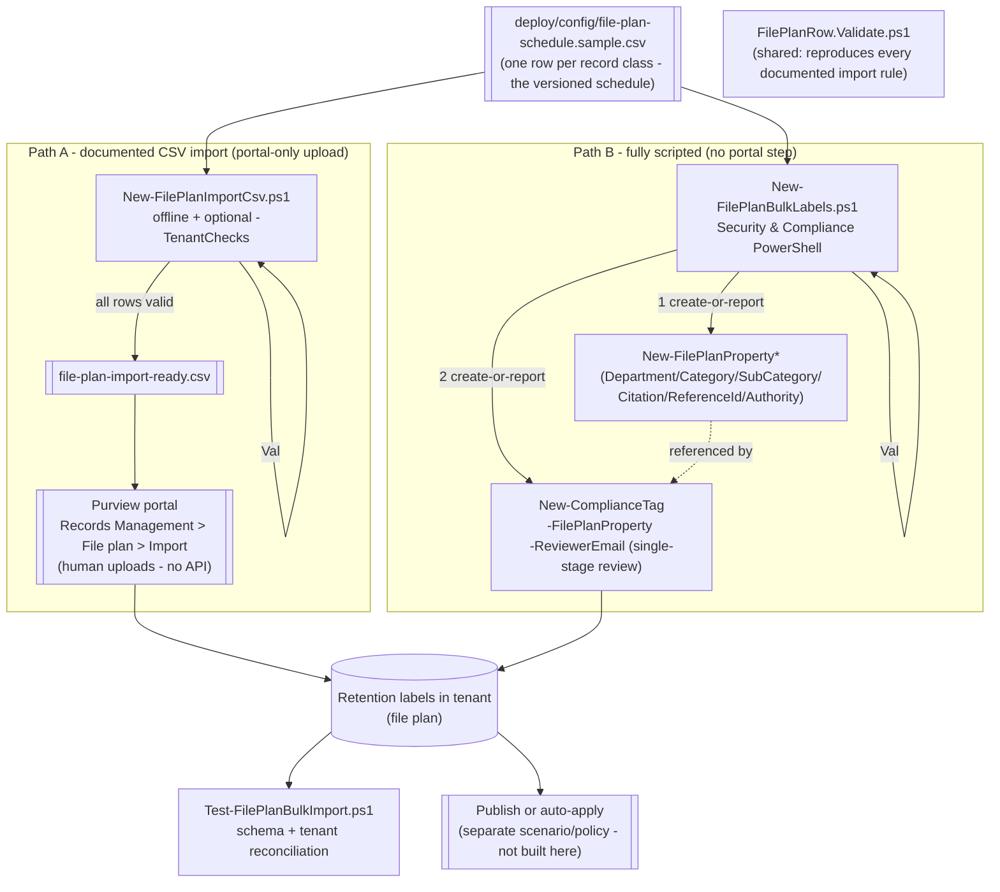

## The short version

Builds a **whole file plan** - many retention-label record classes spanning multiple departments,
categories, and legal citations - from a single versioned CSV schedule, instead of creating labels
one at a time in the portal. Ships **two** automation paths reading the **same** source file: (1) a
validator/generator for Purview's own documented **file plan CSV import** (portal-only - Microsoft
publishes no API for the upload step itself), and (2) a fully-scripted **PowerShell bulk-create**
equivalent (`New-ComplianceTag` + `New-FilePlanProperty*`) for teams who want zero portal
interaction.

**How it differs from the sibling *Event-Based Records Disposition with Disposition Review* scenario:** that scenario builds
the full lifecycle (event type → label → publish policy → gated trigger event) for **one**
representative event-based record class in depth. This scenario is the **breadth** complement: many
classes, mostly age-based (not event-based), created in bulk from a schedule - the multi-class
follow-up that scenario's own design notes flagged as a non-goal.

**How it differs from *Retention Labels for Financial Records*:**
that scenario auto-applies **one** age-based retention label via policy, deliberately without file
plan descriptors or bulk creation (the design notes flags both as out of scope for that starter). This
scenario is the natural next step for a team outgrowing that single-label starter into a formal,
versioned, multi-class file plan.

## Why this matters

A real organizational file plan is rarely one record class - it's the **entire retention schedule**:
personnel files, financial books and records, executed contracts, litigation holds, security logs,
signed customer agreements, and regulator correspondence, each with its own retention period,
authority, and department owner. Microsoft Purview's **file plan** is explicitly the tool for this:
it "lets you create retention labels interactively **or import in bulk**... labels support
additional administrative information to help you identify and track business or regulatory
requirements". Hand-building dozens of labels through the portal UI, one at a
time, doesn't scale and isn't reproducible or diffable for an examiner. Defining the schedule as a
single CSV - validated locally before it ever reaches the tenant - makes the whole file plan a
version-controlled artifact, and directly supports **SOX** (financial books and records), **FLSA**
(HR/payroll records), **IRS** recordkeeping requirements, and internal records-retention schedules
generally, each citable per-row via the **Provision/citation** file plan descriptor.

> ⚠️ **Two things a bulk import cannot do.** (1) It cannot configure **multi-stage** disposition
> review - the CSV import explicitly does not support it, and the PowerShell path here (single
> `-ReviewerEmail`) doesn't either; that's a tracked, separate follow-up
> (*Multi-Stage Disposition Review Panel*). (2) It cannot **delete** or **update** a
> retention label in bulk - `LabelName` and its core retention settings are immutable after
> creation, so a mistake in a shipped row means a **new**, correctly-named label,
> not an edit. Review the schedule carefully (`-DryRun` / offline validation) before creating
> anything.

## How the control works

Both paths validate against the **same** rule set (`FilePlanRow.Validate.ps1`) before touching the
tenant, so a row that would fail the portal's own import validation fails identically here - before
a human uploads anything, or before PowerShell creates anything. Full rationale: the design notes.

## What it takes

### Prerequisites

Full licensing detail: [Licensing matrix](/docs/licensing-matrix/). RBAC: [RBAC model](/docs/rbac-model/). Automation surface:
[Automation surface](/docs/automation-surface/) (surface 2 - Security & Compliance PowerShell). Summary:

| Requirement | Minimum | Notes |
|---|---|---|
| Licensing | **Records management** (file plan, retention labels): **M365 E5 / E5 Compliance / Purview Suite** | File plan import/export and record labels are E5 records-management capabilities |
| Role (file plan access, portal) | **Retention Manager** or **View-only Retention Manager** | Required to see/use the File plan page at all |
| Role (create objects, PowerShell) | **Records Management** role group (RecordManagement / Retention Management roles) | [RBAC model](/docs/rbac-model/) - needed for `New-ComplianceTag` / `New-FilePlanProperty*` |
| Reviewers | Individual users, distribution groups, or security groups | `ReviewerEmail`; multiple addresses separated by **semicolons** in the CSV, by **comma/array** in the `-ReviewerEmail` cmdlet parameter - a genuine syntax difference between the two paths |
| Auth | `Connect-IPPSSession` (certificate app-only preferred) | Security & Compliance PowerShell - [Automation surface, section 3](/docs/automation-surface/#3-authentication-patterns---interactive-vs-unattended) |
| Portal path (CSV-import route only) | Records Management → File plan → Import | Human uploads the validated CSV - there is no API/cmdlet for this step |

> Verify current entitlement names against [Licensing matrix](/docs/licensing-matrix/) (dated 2026-09-02) before a
> sales commitment - SKU names change.

### Cost and licensing

- **Per-user E5 entitlement**, no Azure consumption meter. File plan (create/import/export) and
  record labels are **E5 / E5 Compliance / Purview Suite** records-management capabilities.
- **Cost is licensing + storage + the labor of building the schedule once**, not per-label. Bulk
  creation front-loads the schedule-design work (department sign-off, citations, retention periods)
  so the ongoing marginal cost of adding one more record class is small - append a CSV row.
- **The expensive mistake is a rushed schedule.** Because `LabelName` and core retention settings are
  immutable, importing a bad schedule at scale means dozens of permanently-misnamed or
  wrongly-scheduled labels, not one. Validate before either deploy path runs against a
  production tenant.

## Proof it works

1. **Schema validation (always)** - `New-FilePlanImportCsv.ps1` (offline) or
   `validate/Test-FilePlanBulkImport.ps1` reproduces every documented rule and reports row number +
   column, exactly like the portal's own upload validation.
2. **Tenant checks (Path A, before upload)** - `New-FilePlanImportCsv.ps1 -TenantChecks` confirms no
   `LabelName` collision and every referenced `EventType` already exists.
3. **Post-creation reconciliation (either path)** - `validate/Test-FilePlanBulkImport.ps1` (connected)
   confirms each row's label exists with matching `RetentionAction`/`RetentionType`/
   `RetentionDuration`/`IsRecordLabel`. File-plan-descriptor read-back is reported informationally,
   not hard-asserted (the known limitations - read-back property names unconfirmed).
4. **Portal spot-check (Path A)** - after upload, confirm the success message and that the new
   labels appear on the **File plan** page with the expected descriptors.
5. **Idempotency proof** - re-run either deploy path; every already-created label/descriptor reports
   `exists` (Path B) or is excluded as a tenant-side duplicate (Path A's `-TenantChecks`); nothing is
   duplicated or silently mutated.

## Where it stops

- **The CSV import step itself has no API.** Microsoft's file plan "Import" is a portal action
  (download template → fill in → upload) with no documented Graph/REST endpoint or PowerShell
  cmdlet - `New-FilePlanImportCsv.ps1` validates and prepares the file; a human
  still clicks Upload. Path B (`New-FilePlanBulkLabels.ps1`) is the only fully unattended route.
- **Multi-stage disposition review is out of scope for both paths.** The CSV import explicitly does
  not support it, and this scenario's PowerShell path uses single-stage
  `-ReviewerEmail` only. A dedicated *Multi-Stage Disposition Review Panel* fragment
  (`-MultiStageReviewProperty`) is tracked separately in the project backlog.
- **`ReviewerEmail` syntax differs by path.** The CSV import documents **semicolon**-separated
  addresses in one cell; `New-ComplianceTag -ReviewerEmail` takes a PowerShell
  `SmtpAddress[]` array. `New-FilePlanBulkLabels.ps1` splits on `;` and re-assembles the array so one
  CSV cell format serves both paths.
- **`CitationUrl`/`CitationJurisdiction` are not settable via `New-FilePlanPropertyCitation` in
  Path B.** That cmdlet's documented syntax takes only `-Name` - this script
  creates/links the citation **name** and warns when a row also sets a URL/jurisdiction, since
  setting those requires the portal. Path A (CSV import) does support all three citation columns
  natively, since the import itself (not a cmdlet) writes them.
- **`LabelName` and core retention settings are immutable after save** - see operations and tuning. Neither script
  offers an "update" mode by design (records objects are never silently mutated, matching the
  sibling *Event-Based Records Disposition with Disposition Review* scenario's philosophy).
- **`Regulatory=TRUE` has a tenant-configuration prerequisite** this scenario cannot check
  client-side (the tenant must be configured to display the regulatory-record option, or import
  validation fails) - both scripts warn on any `Regulatory=TRUE` row; the sample
  schedule ships with none set to keep the default run tenant-config-independent.
- **VERIFY (pilot tenant):** the exact column **order** and header spelling of the live "Download a
  blank template" file - that template is a portal-generated artifact with no linked, fetchable copy
  in Microsoft Learn. This scenario's column set and names are grounded verbatim against the
  documented property table; confirm exact column order against a real template
  download before a first production upload (Path A only - Path B doesn't depend on column order).
- **VERIFY (pilot tenant):** the property name(s) `Get-ComplianceTag` exposes for file-plan
  descriptor read-back - not documented, so `validate/Test-FilePlanBulkImport.ps1` reports
  descriptors informationally rather than asserting on them.
- **VERIFY closed 2026-09-28 (Microsoft Learn MCP, maintenance pass):** the exact
  `Search-UnifiedAuditLog` `RecordType`/`Operations` values for a retention-label
  **definition/creation** event are `RecordType DataGovernance` (value 38 - "Events related to
  retention policies and retention labels in the Microsoft Purview portal") /
  `Operations NewComplianceTag` (friendly name "Created retention label" - "Administrator created a
  new retention label"), directly confirmed against Microsoft's
  own **Audit log activities** and **Office 365 Management Activity API schema** reference pages
  rather than assumed. This is distinct from the already-documented label **application** events
  (`Changed retention label for a file` / `Labeled message as a record`). An
  audit-trail export script for bulk-creation events built on this confirmed `RecordType`/`Operations`
  pair remains a tracked follow-up - not built in this maintenance-only pass.
- **CSV/formula-injection guard is a general defensive control, not a Microsoft-documented rule.**
  `FilePlanRow.Validate.ps1` refuses any free-text column whose value starts with `=`, `+`, `-`, or
  `@`, or contains a raw tab/CR/LF - the classic spreadsheet-formula-injection vector, relevant
  because the documented workflow has a human open the file in a spreadsheet app before uploading it. If a legitimate value needs one of those leading characters, prefix it with a space or
  apostrophe.
- **Illustrative values.** The sample schedule's ten record classes, retention periods, citations,
  and reviewer addresses are placeholders - replace with your organization's real, Records/Legal
  -approved schedule before deploying.