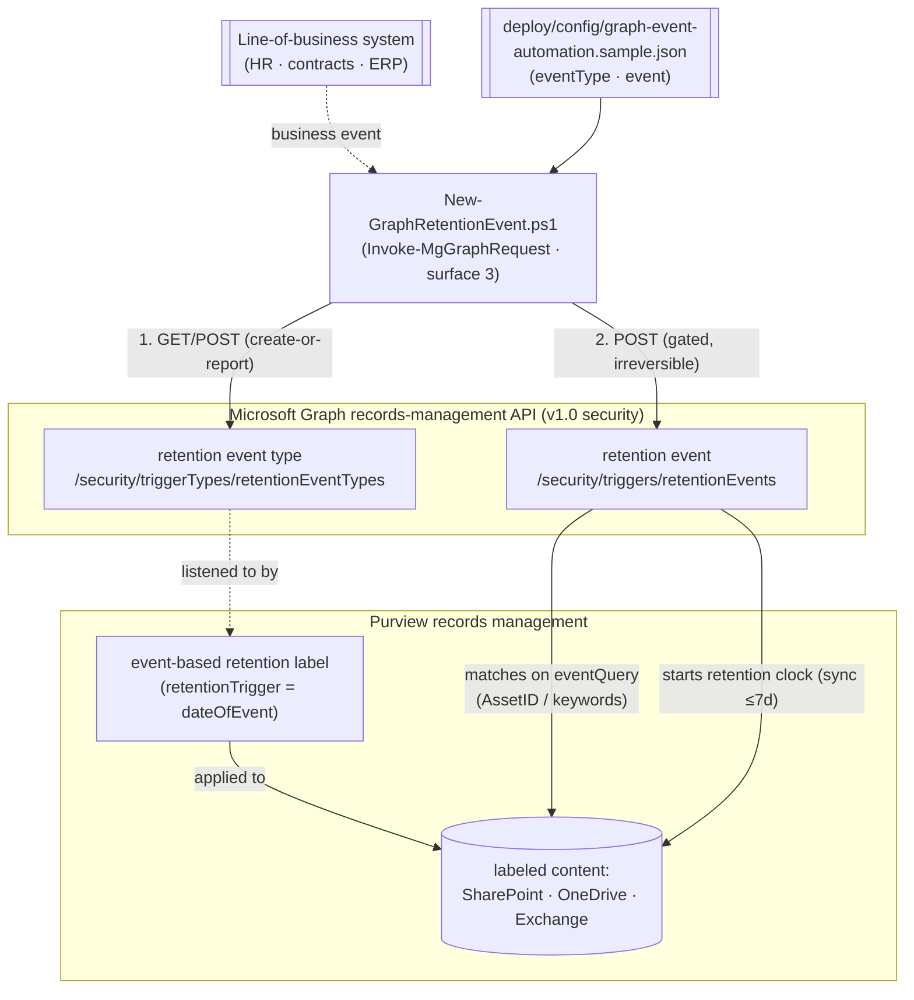

## The short version

Wires a **business system** (HR, contract management, ERP) into Microsoft Purview **event-based
retention** using the **Microsoft Graph records-management APIs**: it ensures a **retention event
type** exists, and - gated behind an explicit switch and sign-off - **fires a retention event** that
starts the retention clock for matching event-based-labeled content. This is the **automation
complement** to the PowerShell scenario in *Event-Based Records Disposition with Disposition Review*
(which defines the event type, the event-based record label, and the publish policy in Security &
Compliance PowerShell). Here the same lifecycle's **trigger** is driven programmatically over Graph, so
"the contract expired" or "the employee left" can start retention **automatically** the moment the
business event is recorded - no records manager clicking in the portal.

**How it differs from the PowerShell records scenario:** that one uses **Security & Compliance
PowerShell** (`New-ComplianceRetentionEvent`) and is the human/admin path; this one uses **Microsoft
Graph** (surface 3) - the **modern, supported automation path** (Microsoft has **deprecated** the
older REST event API) - designed for **app-only** service integration and exposing Graph's
**event-propagation status** that the PowerShell cmdlets don't surface.

## Why this matters

Event-based retention only works if the **event actually fires** when the business event happens. A
records schedule that says "retain 7 years after contract expiry" is worthless if a person has to
remember to log into the portal and create an event for every expiring contract. The value - and the
audit-defensibility - comes from **automating the trigger**: the contract system marks a contract
expired, and that same transaction fires a Microsoft Graph retention event, starting the clock for
exactly that contract's records.

Microsoft's guidance is explicit: automate event-based retention with the **Microsoft Graph
records-management APIs**; the **previously-available REST event API is deprecated and no longer works**. So a current-best-practice integration uses Graph. The obligations behind it are the
same event-anchored records rules the sibling scenario covers (DoD 5015.02, SEC 17a-4 / FINRA 4511
schedules, GDPR/CCPA storage-limitation) - this scenario is about making the **trigger** reliable,
reproducible, and machine-driven.

> ⚠️ **Firing an event is irreversible.** A retention event, once created, **cannot be cancelled**, and
> deleting the event does **not** stop the retention it started. So the event is fired only with
> `-FireEvent` **and** `event.fire=true` in config, and always through `ShouldProcess` (real `-WhatIf`).
> Test in a lab tenant and get Records/Legal sign-off. See the known limitations.

## How the control works

The event type is idempotent (create-or-report by displayName); firing the event is the irreversible,
gated step. The event matches content by `eventQuery` (Asset ID for SharePoint/OneDrive, keywords for
Exchange). Full rationale: the design notes.

## What it takes

### Prerequisites

Full licensing detail: [Licensing matrix](/docs/licensing-matrix/). RBAC: [RBAC model](/docs/rbac-model/). Automation surface:
[Automation surface](/docs/automation-surface/) (surface 3 - Microsoft Graph, both the PowerShell SDK and raw REST are
the same unified surface). Summary:

| Requirement | Minimum | Notes |
|---|---|---|
| Licensing | **Records management** (event-based retention): **M365 E5 / E5 Compliance / Purview Suite** | Same entitlement as the sibling records scenario |
| Graph permission | **`RecordsManagement.ReadWrite.All`** (fire/create); **`RecordsManagement.Read.All`** (validate) | Delegated or **Application** (app-only) |
| Role (delegated) | A records-management role that can manage events (e.g. Records Management / Retention Management) | For a signed-in user; app-only uses the granted app permission |
| SDK | **Microsoft.Graph** PowerShell (`Connect-MgGraph`, `Invoke-MgGraphRequest`) | Or the typed `Microsoft.Graph.Security` cmdlets - see the configuration reference |
| Published event-based label | An event-based retention label bound to the event type (portal, or the sibling PowerShell scenario) | The event does nothing without content carrying a matching event-based label |

> Verify current entitlement names against [Licensing matrix](/docs/licensing-matrix/) (dated 2026-09-02) before a
> sales commitment - SKU names change.

### Cost and licensing

- **Per-user E5 entitlement**, no Azure consumption meter. Same records-management entitlement as the
  sibling scenario; Microsoft Graph API calls themselves have no per-call charge.
- **Cost is integration engineering + governance.** The spend is building and operating the LOB→Graph
  integration reliably, and the storage of records held (possibly for years) once events fire.
- **The expensive mistake is a mis-scoped or runaway event.** An event with no `eventQuery`, or an
  integration bug that fires broadly, starts irreversible retention across content - the dominant risk.

## Proof it works

1. **Automated** - `./validate/Test-GraphRetentionEvent.ps1` confirms the event type exists and reports
   any events fired for it, with **eventStatus** and **eventPropagationResults** per workload. Exits
   non-zero if the event type is missing.
2. **Idempotency proof** - re-run the deploy without `-FireEvent`; the event type reports `exists` (not
   `created`) and nothing is duplicated.
3. **`-WhatIf` proof** - run the deploy with `-WhatIf` and confirm it prints the intended POSTs and
   fires nothing (no event type or event is created).
4. **Fire test (lab tenant)** - with `event.fire=true` and `-FireEvent`, fire a dated event scoped by
   `ComplianceAssetID`; confirm via validate that the event exists and report its propagation status;
   confirm (up to **7 days** later) that matching labeled content's retention clock has started.
5. **Disposition proof** - for a short lab retention, confirm the content reaches a disposition review /
   disposal per the label (managed by the sibling records scenario / portal).

## Where it stops

- **A fired event can't be cancelled**, and deleting it does **not** stop the retention it started. Firing is gated behind `-FireEvent` **and** `event.fire=true`, and always goes
  through `ShouldProcess` (real `-WhatIf`).
- **The REST event API is deprecated** - this scenario uses **Microsoft Graph**, the supported path.
- **The event does nothing without matching labeled content.** Content must already carry an event-based
  retention label bound to this event type (portal, or the sibling PowerShell scenario) - the event only
  starts the clock for content that's already listening.
- **Scope is dangerous by default.** An event with an empty `eventQuery` triggers retention for **all**
  content with that event type's label. The sample ships an Asset-ID query and
  `fire=false`.
- **Latency.** A fired event syncs to content in **up to 7 days** - don't mistake latency for failure;
  check `eventPropagationResults` for per-workload progress.
- **`@odata.bind` path quirk.** Microsoft's own v1.0 example binds via
  `.../triggerTypes/retentionEventType/{id}` (singular) while the collection is
  `retentionEventTypes` (plural); this scenario binds to the **plural collection path** with the
  resolved type **id**. Verify against current docs if a bind fails.
- **High-privilege app identity.** `RecordsManagement.ReadWrite.All` app-only can start irreversible
  retention - protect the credential and monitor its use.
- **`eventQuery` vs `eventQueries`.** The v1.0 create body uses `eventQuery`; some SDK models expose
  `eventQueries`. This scenario follows the documented v1.0 REST body (`eventQuery`).
- **Illustrative values.** The event-type name, event name, Asset ID, and timestamp are placeholders -
  set them from your business system's real data before wiring up.