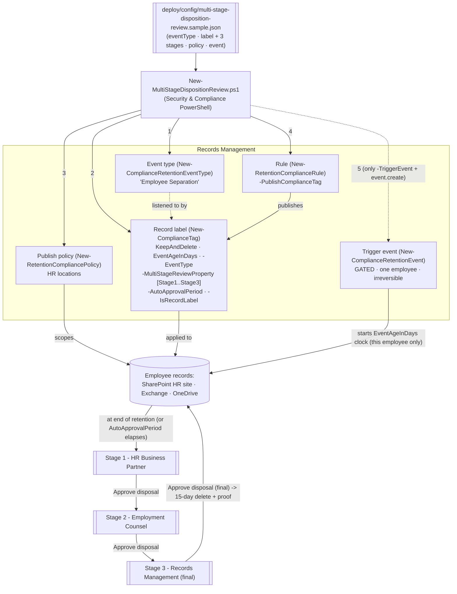

## The short version

Extends the event-based records-disposition pattern
(*Event-Based Records Disposition with Disposition Review*) with a **multi-stage disposition review**
panel: a record label whose disposal requires **sequential sign-off from up to 5 reviewer stages**
(`-MultiStageReviewProperty` on `New-ComplianceTag`), not a single reviewer set. Built here for **employee
separation records** - HR Business Partner → Employment Counsel → Records Management - the representative
case where one approver isn't enough because the record may become evidence in a future employment claim.

**How it differs from the parent scenario:** that one uses `-ReviewerEmail` (a single reviewer set); this
one uses `-MultiStageReviewProperty` (a JSON-defined, sequential chain of named stages, each with its own
reviewers), plus `-AutoApprovalPeriod` to stop the chain stalling and an optional
`-ComplianceTagForNextStage` pass-through for relabeling at the end of the retention period. Same
event-based clock, same publish model, same irreversible-trigger gating - different disposal-approval shape.

## Why this matters

Employee personnel and separation records can become evidence in an EEOC charge, a wrongful-termination
suit, or a wage claim - the organization's exposure doesn't end when the employee leaves. U.S. federal
recordkeeping already sets floors well past "delete when convenient": the EEOC requires preserving
personnel/employment records for **1 year** from the record or the personnel action, whichever is later,
and - critically - **until final disposition** of any charge or action filed against the record; FLSA requires **3 years** for payroll records and **2 years** for records underlying
wage computations. None of that alone justifies a multi-stage *review*, though - the
real driver for a chain (vs. a single reviewer, per the parent scenario) is that the person closest to a
separation (HR) is the **least** appropriate sole approver of destroying that separation's own records.
Adding Employment Counsel and Records Management as independent, sequential sign-offs is the actual
control. Microsoft Purview's multi-stage disposition review models exactly this: **up to 5 sequential
stages**, each with its own reviewer set (individual users or mail-enabled security groups, up to 10 per
stage), where only the **final** stage's approval permanently disposes the item.

> **Not cited here: Executive Order 11246.** Federal-contractor affirmative-action recordkeeping under EO
> 11246 was rescinded by EO 14173 (Jan 21, 2025); OFCCP's final rule rescinding the implementing
> regulations takes effect **October 26, 2026** - imminent as of this scenario's build
> date. It is deliberately not used as a driver. Section 503 (Rehabilitation Act) and VEVRAA recordkeeping
> for covered federal contractors remain independently in force and are a legitimate customer-specific
> add-on - see the design notes.

> ⚠️ **Two irreversible edges, same as the parent scenario.** (1) A **triggered event cannot be
> cancelled**. (2) A **record label that has been applied cannot be deleted** and its retention/reviewer
> chain cannot be shortened or edited by this scenario's scripts. See the known limitations.

## How the control works

Same five build objects as the parent scenario, plus a **sequential 3-stage** review: any stage's approval
advances the item, only the last stage's approval disposes it. Full rationale: the design notes.

## What it takes

### Prerequisites

Full licensing detail: [Licensing matrix](/docs/licensing-matrix/) (dated 2026-09-10). RBAC: [RBAC model](/docs/rbac-model/).
Automation surface: [Automation surface](/docs/automation-surface/) (surface 1 - Security & Compliance PowerShell). Summary:

| Requirement | Minimum | Notes |
|---|---|---|
| Licensing | **Records management** (record labels, event-based retention, disposition review): **M365 E5 / E5 Compliance / Purview Suite** | Multi-stage disposition review is part of the same E5 records-management capability set as the parent scenario |
| Role (config) | **Records Management** or **Retention Management** role group | To create event types, labels (including the reviewer chain), policies, rules - [RBAC model](/docs/rbac-model/) |
| Role (disposition, per stage) | **Disposition Management** role (in the Records Management role group; **not** granted to global admins by default) | Every stage's reviewers need this role to see and act on their stage's items |
| Reviewers (per stage) | Individual **users** or **mail-enabled security groups** (not Microsoft 365 Groups) | Up to **10 reviewers per stage**, up to **5 stages** |
| Auth | `Connect-IPPSSession` (certificate app-only preferred) | Security & Compliance PowerShell - [Automation surface, section 3](/docs/automation-surface/#3-authentication-patterns---interactive-vs-unattended) |
| Target locations | SharePoint site(s) / mailboxes / OneDrive (HR locations here) | Publish policy needs ≥1 location |

> Verify current entitlement names against [Licensing matrix](/docs/licensing-matrix/) before a sales commitment - SKU
> names change.

### Cost and licensing

- **Per-user E5 entitlement**, no Azure consumption meter, no separate charge for additional review
  stages - multi-stage disposition review is part of the same records-management capability set as the
  parent scenario.
- **Cost is licensing + storage + reviewer labor, multiplied by stages.** A 3-stage chain means 3
  distinct teams' review time per disposal decision, not 1 - budget accordingly, and weigh that against
  `AutoApprovalPeriod` shortcuts that trade cost for risk.
- **The expensive mistake is the same as the parent scenario's, plus one:** a mis-scoped event (retains
  everyone's records, not one employee's), **and** an `AutoApprovalPeriod` set on the final stage that's
  shorter than that team's realistic response time, turning "reviewed disposal" into "timed auto-delete."

## Proof it works

1. **Automated** - `./validate/Test-MultiStageDispositionReview.ps1` confirms the event type exists; the
   label exists as a record with `KeepAndDelete`/`EventAgeInDays`, is bound to the event type; reads back
   the reviewer chain (stage count, names) as `[WARN]`-level checks (see the known limitations on the read-back property's
   confirmation status); confirms the publish policy/rule; reports triggered events and whether
   `AutoApprovalPeriod` is set. Exits non-zero on a hard failure.
2. **Publish test** - apply the published label to a test item (or set as a default library label);
   confirm it appears. Publishing can take up to **7 days**.
3. **Event / clock test (lab tenant)** - create a dated event scoped to one test "employee," confirm the
   clock starts for that employee's labeled content only (sync up to 7 days).
4. **Multi-stage review test (lab tenant)** - for a short test duration, let retention elapse (or wait for
   `AutoApprovalPeriod`) and confirm: a disposition item appears for **Stage 1**'s reviewers only; a Stage
   1 "Approve disposal" moves it to **Stage 2**; only **Stage 3**'s approval marks it for permanent
   deletion (15 days later) with proof of disposition retained. Also test **Relabel**
   and **Extend** at an intermediate stage to confirm the chain doesn't silently continue past a reviewer
   who chose neither delete-path option.
5. **Auto-approval test (lab tenant, short window)** - set a short `AutoApprovalPeriod` on a disposable
   test label, let it elapse with no reviewer action, and confirm the item advances (or, at the final
   stage, is disposed) **without** a reviewer action - proving the risk documented in section 8, not just
   asserting it.
6. **Idempotency proof** - re-run the deploy; every object reports `exists` (not `created`); the reviewer
   chain is not re-sent or mutated on an existing label; no event is created without `-TriggerEvent` +
   `event.create`.
7. **Evidence export for an auditor/examiner** -
   *Disposition Proof Export* adds a scriptable, schedulable rolling
   audit trail of `AddReviewer`/`ApproveDisposal`/`ExtendRetention`/`RelabelItem`/`RecordDelete`
   events (companion to the portal's own per-label Filter+Export `.csv`), applicable to this
   scenario's multi-stage chain the same way it applies to the parent single-reviewer scenario.

## Where it stops

- **`-ComplianceTagForNextStage`'s behavior is now grounded (closed 2026-09-27, was previously flagged
  VERIFY).** `New-ComplianceTag`/`Set-ComplianceTag`'s own published parameter reference still leaves the
  description as an unfilled placeholder, but Microsoft's file plan
  manager documents an identically-named `ComplianceTagForNextStage` import property: "the name of a
  [replacement label] to be applied at the end of the retention period. Do not specify this property if
  Regulatory is TRUE", and the "Relabeling at the end of the retention period"
  reference confirms the full mechanics: the item becomes subject to the replacement
  label's own retention settings, replacement labels can be chained with no documented limit, a regulatory
  record can't be relabeled (though its replacement label can itself be marked regulatory), changing the
  replacement label after creation synchronizes to already-labeled items within up to 7 days, and a
  replacement label can't be deleted while selected. The Microsoft Graph records-management `retentionLabel`
  resource's `labelToBeApplied` property remains a corroborating (not primary) analog. It remains off by
  default (`null`) and is passed through only if explicitly configured.
- **VERIFY (pilot tenant): the `MultiStageReviewerMetadata` read-back property.** `Get-ComplianceTag`'s
  own published output documentation does not list a property for reading back the reviewer chain;
  `MultiStageReviewerMetadata` (with `StageId`/`StageName`/`Reviewers`) is corroborated by third-party
  worked examples of real `Get-ComplianceTag` output, not by Microsoft's own reference. `validate/
  Test-MultiStageDispositionReview.ps1` reads it defensively via `PSObject.Properties[...]` and reports
  every check touching it as `[WARN]`, never `[FAIL]` - confirming the exact property name/casing in a
  pilot tenant would let a future revision treat it as a hard check.
- **Microsoft's own `-MultiStageReviewProperty` example is not valid JSON as published** (unquoted
  reviewer values). This scenario's deploy script always emits valid JSON via `ConvertTo-Json` - see
  the design notes and the script's `.NOTES`.
- **`AutoApprovalPeriod` is a silent-approval risk, not just a convenience** - see operations and tuning. Treat it as a
  reviewed operational decision per stage, not a default to accept unexamined.
- **A triggered event can't be cancelled**, and **an applied record label can't be deleted** - identical
  irreversibility to the parent scenario. See why this matters and the rollback plan.
- **The event type is immutable after the label is saved with it**; **the reviewer chain is not retrofit
  onto an existing label** by this scenario's deploy - both are deliberate, create-or-report boundaries.
- **`-WhatIf` is non-functional in S&C PowerShell** - the scripts ship `-DryRun` instead.
- **Latency.** Publishing and event sync each take up to **7 days** - don't mistake latency for failure.
- **Disposition RBAC is per-stage.** The Disposition Management role isn't granted to admins by default;
  a stage's reviewers who lack it won't see that stage's items even though the chain is otherwise healthy.
- **No scripted way to query per-stage disposition backlog was found.** Pending-disposition queue depth
  per stage appears to be portal-only (Records Management → Disposition); no documented PowerShell/Graph
  cmdlet for it surfaced during this build's grounding pass. operations and tuning's "per-stage backlog" KPI is therefore a
  manual/portal check today - tracked as a follow-up in the project backlog (re-check if Microsoft documents
  one) rather than assumed away.
- **Illustrative values.** The event-type name, 3-year duration, stage names/reviewers, site URL, and
  asset-ID query are placeholders - set them to your real records schedule and sign-off chain, validated
  by Records/Legal/HR, before deploying.