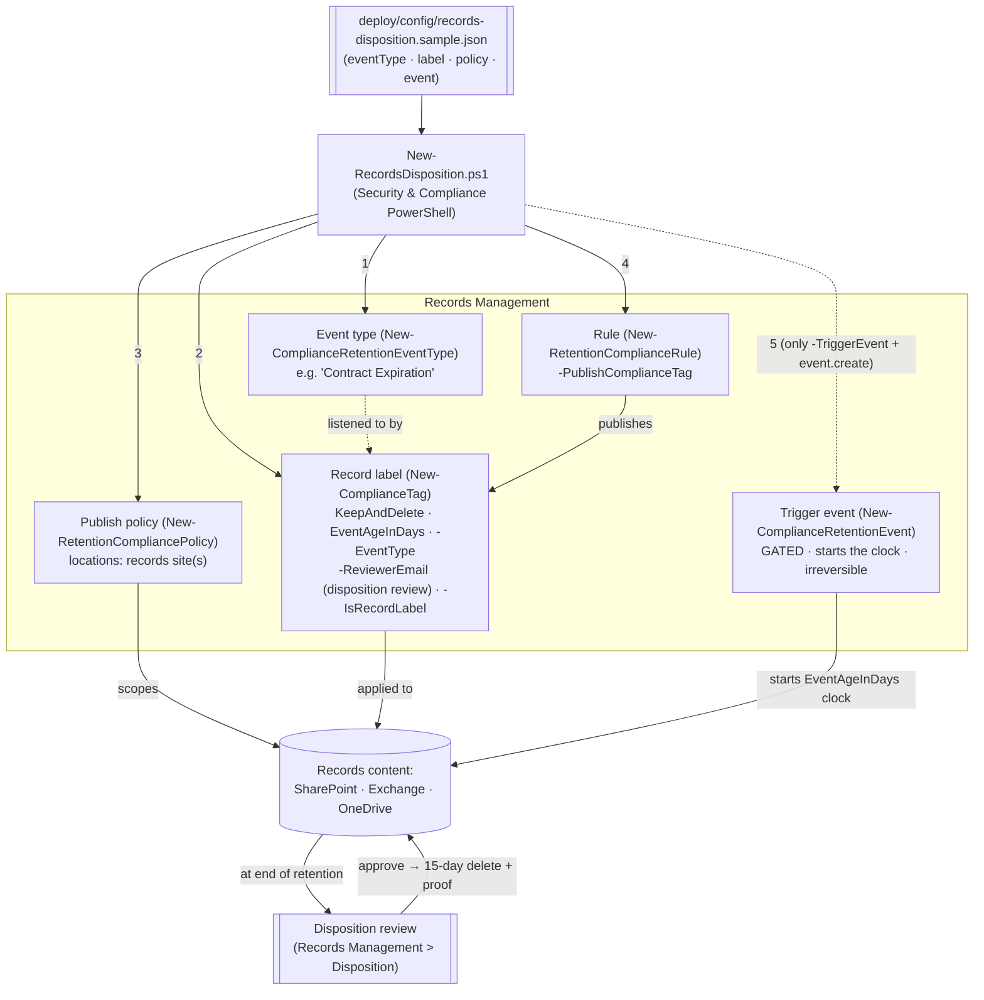

## The short version

Builds the full **records-management disposition lifecycle** as code: an **event type** (e.g. "Contract
Expiration"), an **event-based record label** whose retention clock starts on that event and ends in a
**disposition review** rather than an automatic delete, a policy that **publishes** the label so it can
be applied, and - gated behind an explicit switch and sign-off - the **trigger event** that starts a
real retention clock. This is the *retain-until-event → review → dispose* pattern that records managers
need for records whose life is defined by a business event, not by the age of the file.

**How it differs from the DLM regulatory-retention scenario** (*Retention Labels for Financial Records*):
that one uses a **regulatory record** label with a **creation-age** clock and **auto-applies** it; this
one uses an **event-based** clock (`EventAgeInDays`), a **`KeepAndDelete`** action with a **disposition
review**, and **publishes** the label for controlled application. Different obligation, different
lifecycle - deliberately complementary, not a duplicate.

## Why this matters

Many retention obligations are **event-anchored**, not age-anchored: "retain contract records for 7
years **after the contract expires**", "retain employee records for 10 years **after separation**",
"retain product specs until **end-of-life** plus 5 years". You cannot express these with a
creation/modification-age clock - the start date isn't known when the content is created. Microsoft
Purview **event-based retention** models exactly this: a label listens for an **event type**, and when a
dated **event** is created the retention period begins for the matching content.

Because these records are usually **declared records** and their disposal has legal weight, best
practice is to end retention with a **disposition review** - a records manager (or a multi-stage panel)
**reviews and approves** disposal, and the system keeps **proof of disposition**.
That reviewed, evidenced disposal is what regulators and auditors ask to see. **DoD 5015.02**,
**SEC 17a-4 / FINRA 4511** (records schedules), **GDPR/CCPA** storage-limitation, and internal records
schedules all point at this lifecycle. Managing it as code makes the schedule reproducible and the
disposition defensible.

> ⚠️ **Two irreversible edges.** (1) A **triggered event cannot be cancelled** - deleting the event does
> not stop retention it already started. (2) A **record label that has been applied cannot be deleted**
> and its retention cannot be shortened. So the trigger event is gated (`-TriggerEvent` **and**
> `event.create=true`), and the deploy is create-or-report. Test in a lab tenant, review with `-DryRun`,
> and get Records/Legal sign-off. See the known limitations.

## How the control works

Five objects, staged so nothing starts a clock by accident: the **event type** and **label** define the
schedule, the **policy+rule** publish the label, and the **event** (gated) starts retention. Disposal at
the end is a **reviewed** step. Full rationale: the design notes.

## What it takes

### Prerequisites

Full licensing detail: [Licensing matrix](/docs/licensing-matrix/). RBAC: [RBAC model](/docs/rbac-model/). Automation surface:
[Automation surface](/docs/automation-surface/) (surface 2 - Security & Compliance PowerShell). Summary:

| Requirement | Minimum | Notes |
|---|---|---|
| Licensing | **Records management** (record labels, event-based retention, disposition review): **M365 E5 / E5 Compliance / Purview Suite** | Event-based retention + disposition are E5 records-management capabilities |
| Role (config) | **Records Management** or **Retention Management** role group | To create event types, labels, policies, rules - [RBAC model](/docs/rbac-model/) |
| Role (disposition) | **Disposition Management** role (in the Records Management role group; **not** granted to global admins by default) | Reviewers need this to see and act on disposition items |
| Reviewers | Individual **users** or **mail-enabled security groups** (not Microsoft 365 Groups) | Up to 10 reviewers/stage, up to 5 stages |
| Auth | `Connect-IPPSSession` (certificate app-only preferred) | Security & Compliance PowerShell - [Automation surface, section 3](/docs/automation-surface/#3-authentication-patterns---interactive-vs-unattended) |
| Target locations | SharePoint site(s) / mailboxes / OneDrive | Publish policy needs ≥1 location |

> Verify current entitlement names against [Licensing matrix](/docs/licensing-matrix/) (dated 2026-09-02) before a sales
> commitment - SKU names change.

### Cost and licensing

- **Per-user E5 entitlement**, no Azure consumption meter. Event-based retention, record labels, and
  disposition review are **E5 / E5 Compliance / Purview Suite** records-management capabilities.
- **Cost is licensing + storage + records-management labor.** Records held until an event (which may be
  years away, or indefinite if the event never fires) accrue storage; and disposition **review** is
  human effort - budget reviewer time, or use auto-approval where defensible.
- **The expensive mistake is a mis-scoped event.** An event without an asset-ID query starts retention
  across everything carrying that event-type label - a broad, hard-to-unwind action.

## Proof it works

1. **Automated** - `./validate/Test-RecordsDisposition.ps1` confirms the event type exists; the label
   exists as a record with `KeepAndDelete` / `EventAgeInDays`, is bound to the event type, and has a
   disposition reviewer; the publish policy exists, is enabled, has ≥1 location; the rule publishes the
   label; and reports any already-triggered events. Exits non-zero on failure.
2. **Publish test** - apply the published label to a test item (or set it as a default library label);
   confirm it appears (portal, or the item's compliance tag). Publishing can take up to **7 days**.
3. **Event / clock test (lab tenant)** - create a dated event (`-TriggerEvent`) scoped by asset ID, and
   confirm the retention clock starts for matching labeled content (sync up to 7 days).
4. **Disposition test (lab tenant)** - for a short test duration, let retention elapse and confirm a
   **disposition item** appears in **Records Management → Disposition** for the reviewer, that approval
   moves it toward deletion (**15 days** after approval), and that **proof of disposition** is retained.
5. **Idempotency proof** - re-run the deploy; every object reports `exists` (not `created`); nothing is
   duplicated or silently mutated; no event is created without `-TriggerEvent` + `event.create`.
6. **Evidence export for an auditor/examiner** -
   *Disposition Proof Export* documents the portal's own Filter+Export
   `.csv` workflow for this evidence and adds a scriptable, schedulable rolling audit trail
   (`Search-UnifiedAuditLog` against the disposition-review and record-deletion Operations) as a
   companion to the manual per-label export above.

## Where it stops

- **A triggered event can't be cancelled.** Deleting the event does **not** stop the retention it
  started; there's no undo. The trigger is gated behind `-TriggerEvent` **and** `event.create=true`, and
  the deploy without those flags starts **no** clock.
- **An applied record label can't be deleted** and its retention can't be shortened - rollback reports
  this rather than forcing it. Confirm you need a *record* label (lockable) vs. a standard retention
  label before declaring records.
- **The event type is immutable after the label is saved with it** - name/scope it deliberately.
- **Event scope is dangerous by default.** An event with no `-SharePointAssetIdQuery` /
  `-ExchangeAssetIdQuery` triggers retention for **all** content with that event-type label. The sample config ships an asset-ID query and `create=false`.
- **`-WhatIf` is non-functional in S&C PowerShell** - the scripts ship a `-DryRun` instead.
- **Latency.** Publishing a label and syncing a triggered event to content each take **up to 7 days** -
  don't mistake latency for failure.
- **Disposition RBAC is separate.** The **Disposition Management** role isn't granted to global admins by
  default; reviewers must hold it, or they won't see disposition items. Reviewers are
  users or mail-enabled security groups, not Microsoft 365 Groups.
- **Idempotency is create-or-report, not create-or-update.** Records objects are high-consequence and are
  never silently mutated - edit deliberately, with review.
- **Events are now automated via Microsoft Graph** (records-management APIs); the earlier REST event API
  is deprecated. PowerShell `New-ComplianceRetentionEvent` remains supported.
- **Illustrative values.** The event-type name, 7-year duration, site URL, reviewer address, and
  asset-ID query are placeholders - set them to your real records schedule, validated by Records/Legal,
  before deploying.