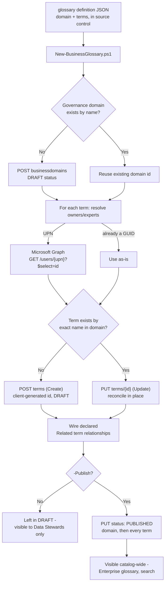

## The short version

Stands up a governance domain and its business glossary - a hierarchy of defined terms with
owners, experts, acronyms, resources, and term-to-term relationships - in Microsoft Purview
Unified Catalog, driven by a single declarative JSON file checked into source control instead of
one-at-a-time portal clicks. The deploy script is a true idempotent upsert: re-running it after
editing a term's definition reconciles the existing term in place rather than creating a
duplicate, something the portal's own bulk-import feature explicitly cannot do.

## Why this matters

A governed, shared vocabulary is the prerequisite every later Unified Catalog capability builds
on: glossary terms carry the policies that scale data governance to data products and assets, and Microsoft's own Cloud Adoption Framework guidance for Purview names
**"populate the glossary"** as the second step of the data-visibility baseline - right after
standing up governance domains and before mapping data sources - specifically to harmonize terms
like *Customer*, *Product*, *Employee*, *Location*, *Revenue*, and *Headcount* that otherwise mean
different things to different departments.

This is a **foundational governance-maturity driver**, not a specific technical control tied to
one regulation - but it directly supports:
- **GDPR/CCPA data-mapping obligations** - a governed *Customer* / *Customer ID* definition is
  what lets a later Data Products or Critical Data Elements scenario correctly scope which assets
  hold regulated personal data, rather than each team guessing independently.
- **SOC 2 / ISO 27001 change-management evidence** - every domain and term change in this
  scenario's model is a reviewable JSON diff in a pull request, not an unaudited portal edit.
- **CDMC (Cloud Data Management Capabilities)** - Unified Catalog's own data-estate-health surface
  tracks control maturity against **CDMC control templates**; a curated
  glossary is a direct input to several of those controls (ownership, business-context, lineage
  intelligibility).

## How the control works

One Unified Catalog governance domain, authored via the **Purview Unified Catalog REST API**
([Automation surface](/docs/automation-surface/) surface 4), containing a small hierarchy of glossary terms. Term
identity resolution for owners/experts is the one place this scenario also calls **Microsoft
Graph** (surface 3) - see the design notes.

## What it takes

### Prerequisites

Full licensing detail and citations: [Licensing matrix](/docs/licensing-matrix/). Summary for this scenario:

| Requirement | Minimum | Notes |
|---|---|---|
| Unified Catalog data governance | **Pay-as-you-go (PAYG)**, billed on unique **governed assets/day** | See section 10 - creating a domain and glossary terms with **no** data assets attached costs **nothing**; the meter only starts once a term/domain is linked to an actual data asset |
| Azure subscription + resource group | Same tenant as the Purview account | Required to enable Purview PAYG billing at all |
| Role to author the domain (if it doesn't exist yet) | **Governance Domain Creator** (Unified Catalog catalog-level role) | [RBAC model, section 5](/docs/rbac-model/#5-data-governance-roles-data-map--unified-catalog---a-separate-model) |
| Role to author terms in an existing domain | **Data Steward** (governance-domain-level role, assigned on the domain's **Roles** tab - a *different* role model from Data Map collections) | [RBAC model, section 5](/docs/rbac-model/#5-data-governance-roles-data-map--unified-catalog---a-separate-model) |
| Automation identity (Unified Catalog) | App registration whose service principal is assigned **Data Steward** (and **Governance Domain Creator** if the domain must be created) in Unified Catalog's **Roles and permissions** / the domain's **Roles** tab | Client-credentials OAuth2 against resource `https://purview.azure.net` - see [Automation surface, section 3](/docs/automation-surface/#3-authentication-patterns---interactive-vs-unattended) |
| Automation identity (Microsoft Graph) | Same app registration, granted the **`User.Read.All`** Graph **application** permission with admin consent | Needed only to resolve owner/expert UPNs to Entra object IDs - least-privileged app permission documented for reading any user by ID/UPN |

> Verify current entitlement names against [Licensing matrix](/docs/licensing-matrix/) and the Product Terms before
> a sales commitment - SKU names and PAYG meters change.

**Compensating controls for `User.Read.All`:** this is a tenant-wide **read-any-user** grant -
Microsoft Graph publishes no narrower application permission for "resolve a UPN to an object ID"
(the known limitations Known limitations expands on this). Because a compromised client secret for this app would
therefore expose basic profile data for every directory user, not just the glossary's owners,
treat the secret with the same handling as any tenant-wide read credential: short expiry, rotation
via a vault (never checked into the definition file or the repo), and - separately - scope the
Unified Catalog **Data Steward**/**Governance Domain Creator** role assignment itself to only the
governance domain(s) this automation is meant to curate, not tenant-wide, so a leaked credential's
blast radius on the Purview side stays bounded even though the Graph side cannot be narrowed
further.

### Cost and licensing

- **This scenario, by itself, costs nothing beyond the base Purview PAYG enablement.** Unified
  Catalog's billing meter counts **governed assets** - a data asset (table, file, report) actively
  linked to a governance concept (data product, critical data element, glossary term) - **not**
  the governance domain or glossary term objects themselves. Microsoft's own
  billing FAQ states this explicitly: "you create 50 governance domains and data products, but
  don't attach any tables, files, reports, or dashboards... you aren't charged for any governed
  assets". This scenario creates a domain and four terms with **zero**
  linked data assets, so it incurs **no PAYG charge** on its own.
- **Cost activates later**, once a future scenario (e.g. linking these terms to data products or
  Data Map-scanned assets - project follow-up) actually attaches a data asset to a term or
  product. At that point, billing is **per unique governed asset per day**, deduplicated across
  however many governance concepts reference the same asset (an asset in five data products is
  still billed once).
- **No per-user license required.** Unlike the DLP/Information Protection scenarios in this
  library, Unified Catalog curation is PAYG-only - it doesn't require Purview E5-tier per-user
  entitlements ([Licensing matrix, section 2](/docs/licensing-matrix/#2-master-capability--license-matrix)).

## Proof it works

1. **Automated check** - `./validate/Test-BusinessGlossary.ps1` confirms the domain and every term
   exist with the expected type/description/acronyms/parent/owner-contact/relationships, exits
   non-zero on any hard failure (safe for a CI-style pre-flight). Publish status is reported as a
   warning, not a hard failure, since DRAFT is a valid pre-review state.
2. **Portal check** - Purview portal → Unified Catalog → the `Customer Experience` domain →
   **Glossary terms** → **View all** → switch the view to **Tree** to visually confirm the
   `Customer` → `Customer ID` / `Customer Lifetime Value` hierarchy.
3. **Enterprise glossary check (after `-Publish`)** - Unified Catalog → **Discovery** → **Enterprise
   glossary** → **Glossary terms** tab; confirm all four terms appear and are searchable by a
   **Catalog Reader**-only account (not just Data Stewards).
4. **Relationship check** - open `Customer Lifetime Value`'s **Related** tab in the portal and
   confirm `Net Promoter Score` appears as a related term.

## Where it stops

- **Portal-only "Term publish" approval workflow.** Microsoft ships an in-portal maker-checker
  workflow for term/data-product publishing but publishes no REST/PowerShell surface for
  *authoring* workflow definitions as of this build. This script's `-Publish` flag performs the
  same `DRAFT`→`PUBLISHED` transition a workflow would eventually gate - if an organization configures the
  native publish workflow, running this script's `-Publish` against a domain in scope for that
  workflow submits the transition for approval rather than completing it immediately; confirm the
  resulting behavior in a pilot tenant before assuming synchronous publish.
- **Two Purview portal generations, two different base URLs.** This scenario's `-PurviewAccountEndpoint`
  parameter must be `https://api.purview-service.microsoft.com` for tenants on the current
  Microsoft Purview portal, or `https://<account>.purview.azure.com` for the classic portal
  - passing the wrong one for a given tenant will fail authentication or
  routing, not silently succeed against the wrong data.
- **`-WhatIf` still performs live, read-only calls.** Unlike some scenarios in this library whose
  dry-run path needs no tenant connectivity at all, this script's existence checks (Query Terms,
  Enumerate Business Domains) are **not** gated behind `ShouldProcess` - they must run for real,
  even under `-WhatIf`, so the script can accurately report "would create" vs. "would update".
  Only the mutating POST/PUT/DELETE calls are suppressed. A `-WhatIf` run therefore still requires
  a reachable tenant and a valid token.
- **VERIFY - `nameKeyword` match semantics.** The Query Terms filter's exact matching behavior
  (substring / prefix / tokenized) isn't documented by Microsoft. This script always re-checks for
  an exact, case-insensitive name match in the returned page rather than trusting the filter
  alone - safe against a false-positive match, but a domain with more
  name-matching terms than fit in one page (`top`, capped at 50 by this script) could in principle
  miss an existing term past that page. This scenario's four-term glossary never approaches that
  limit; a much larger rollout should confirm pagination behavior first.
- **CLOSED 2026-09-27 (Microsoft Learn MCP, re-grounded) - Business Domain Create/Update
  "required" fields.** The formal REST reference's auto-generated Request Body table marks
  `id`, `parentId`, `systemData`, `thumbnail`, `domains`, and `managedAttributes` as
  `Required: True` for both **Create** and **Update**
  - including `id` and `parentId`, which is conclusive evidence this is a
  documentation-generation artifact: the reference reuses the same `Domain` response schema for
  the request body table, so every property of that schema is flagged "required" regardless of
  whether the operation is a client-supplied create field or a server-computed response-only
  field (a client cannot be required to supply the `id` a `POST` itself allocates). Microsoft's
  own **Disaster recovery for Unified Catalog** article - production BCDR guidance, not a
  placeholder example - independently confirms the minimal body works: its worked
  `POST .../businessdomains` call sends only `name`, `type`, `status`, `description`, and
  `managedAttributes: []`, omitting `id`, `parentId`, `systemData`, `thumbnail`, and `domains`
  entirely. This script's minimal-body pattern is correct as documented;
  no code change needed. Re-open as a pilot-tenant VERIFY only if a specific tenant's API
  instance is observed rejecting this minimal body in practice.
- **This scenario does not link terms to data products, data assets, or columns.** That requires
  the target assets to already exist and the automation identity to also hold **Data Reader** on
  the assets' Data Map collection - a natural follow-up scenario once this library has a Data
  Products scenario; see the design notes for the full non-goal list.
- **Update Term is a full-replace `PUT`, not a merge `PATCH`.** Every field this script doesn't
  explicitly send in a create/update call is implicitly cleared by the API on that call - the
  script's body builders (`New-TermRequestBody`, `ConvertTo-TermUpdateBody`) are written to always
  include the complete intended state for exactly this reason. A hand-written call to the API that
  doesn't follow the same discipline will silently drop fields.