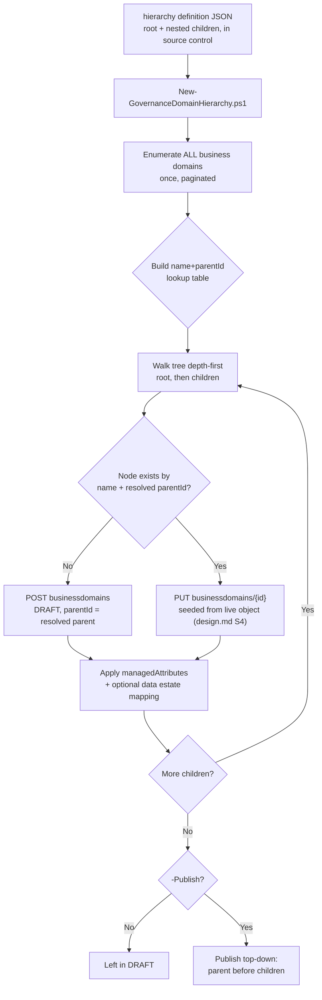

## The short version

Stands up a multi-level Microsoft Purview Unified Catalog **governance domain hierarchy** - a
parent domain with nested child (and grandchild) domains, each carrying its own admin-defined
business-concept attribute values and an optional recommended Data Map collection ("data estate
mapping") - from a single declarative JSON file, with one idempotent deploy script instead of one
domain per portal session. This extends *Curate a Business Glossary*,
which deliberately scoped itself to a single standalone domain and named this exact
gap - multi-domain hierarchies, custom attributes, data estate mappings - as a follow-up (the known limitations of
that scenario, the project backlog).

## Why this matters

Governance domain hierarchies are how Unified Catalog **federates** governance responsibility
across business units while keeping enterprise-wide concepts centrally owned - Microsoft's own
guidance names this "key points of federation for collaboration and governance in your
organization". A domain tree, not a flat list of unrelated domains, is what
lets:
- A **Corporate**-level domain hold enterprise-wide, universally-shared business concepts (a
  single `Customer` definition every business unit inherits context from), while
- **Line-of-business** child domains (`Sales`, `Marketing`) own their own data products and terms
  without re-litigating the enterprise-wide ones, and
- **Regulatory-scoped** grandchild domains (`Sales - EMEA`, `isRestricted: true` in this scenario's
  worked example) ring-fence data-residency-sensitive concepts for a **GDPR** review without
  restructuring the whole tree.

This is a **governance-scaling driver**, same category as *Curate a Business Glossary*'s own section 2, and
directly supports:
- **GDPR/data-residency segregation** - a restricted regional sub-domain is how this scenario
  models "this business concept's data stays regionally scoped," reviewable as a diff rather than a
  portal screenshot.
- **SOC 2 / ISO 27001 change-management evidence** - every domain, its attribute values, and its
  parent placement is a reviewable JSON diff in a pull request.
- **CDMC ownership/accountability controls** - business-concept attributes are
  exactly the kind of structured, admin-governed metadata (e.g. a `Data Classification Tier`
  attribute this scenario's worked example sets per domain) CDMC control templates check for
  (same source *Curate a Business Glossary* (why this matters) cites for this claim).

## How the control works

One Unified Catalog domain tree, authored via the **Purview Unified Catalog REST API**
([Automation surface](/docs/automation-surface/) surface 4) - the Business Domain operation group's `Enumerate`,
`Create`, `Update`, `Get`, and `Delete` operations. Unlike *Curate a Business Glossary*, this scenario
never calls Microsoft Graph - attribute values and data estate mappings need no external identity
resolution.

## What it takes

### Prerequisites

Full licensing detail and citations: [Licensing matrix](/docs/licensing-matrix/). Summary for this scenario:

| Requirement | Minimum | Notes |
|---|---|---|
| Unified Catalog data governance | **Pay-as-you-go (PAYG)**, billed on unique **governed assets/day** | See section 10 - a domain tree with no data assets attached costs nothing, same as *Curate a Business Glossary* section 10 |
| Azure subscription + resource group | Same tenant as the Purview account | Required to enable Purview PAYG billing at all |
| Role to create new domains | **Governance Domain Creator** (catalog-level role) | [RBAC model, section 5](/docs/rbac-model/#5-data-governance-roles-data-map--unified-catalog---a-separate-model) |
| Role to edit/re-run against existing domains | **Governance Domain Owner** (governance-domain-level role; assigned automatically to whoever creates the domain - [RBAC model, section 5](/docs/rbac-model/#5-data-governance-roles-data-map--unified-catalog---a-separate-model)) | Required to edit a domain (name, attributes, data estate mapping, status) per Microsoft's own guidance - distinct from the catalog-level **Governance Domain Creator** role needed only to make a *new* domain |
| Business-concept attribute *definitions* | Pre-created by a **Governance Domain Creator/Data Curator** admin in **Catalog management → Custom metadata (preview)**, scoped to include **Governance Domains** | Portal-only - this scenario only *sets values* for attributes that already exist |
| Target Data Map collection(s) (only if using `dataEstateMapping`) | Already registered in Data Map | This scenario does not create collections - see the design notes |
| Automation identity | App registration whose service principal is assigned the roles above | Client-credentials OAuth2 against resource `https://purview.azure.net` - [Automation surface, section 3](/docs/automation-surface/#3-authentication-patterns---interactive-vs-unattended) |

> Verify current entitlement and role names against [Licensing matrix](/docs/licensing-matrix/)/[RBAC model](/docs/rbac-model/)
> and the Product Terms before a sales commitment - SKU and role names change.

### Cost and licensing

- **This scenario, by itself, costs nothing beyond base Purview PAYG enablement.** Same billing
  fact as *Curate a Business Glossary* section 10: Unified Catalog's meter counts **governed assets** (a
  data asset actually linked to a governance concept), not domain, attribute, or mapping objects
  themselves. A five-domain tree with zero linked data assets incurs **no
  PAYG charge**.
- **Cost activates later**, once a future scenario attaches an actual data asset (via a data
  product, critical data element, or glossary term) to one of these domains.
- **No per-user license required** - PAYG-only, same as *Curate a Business Glossary* section 10
  ([Licensing matrix, section 2](/docs/licensing-matrix/#2-master-capability--license-matrix)).

## Proof it works

1. **Automated check** - `./validate/Test-GovernanceDomainHierarchy.ps1` confirms every domain
   exists under its expected parent, with matching type/description/attribute values, and reports
   (without failing on) publish status and the data estate mapping's presence. Exits non-zero on
   any hard failure.
2. **Portal check** - Purview portal → Unified Catalog → **Governance domains** → confirm
   `Corporate` lists `Sales` and `Marketing` as children, and `Sales` lists `Sales - EMEA`.
3. **Attribute check** - open `Sales - EMEA`'s details page → **Custom attributes** → confirm
   `Data Classification Tier` = `Tier 3 - Regional/restricted`.
4. **Data estate mapping check (if not skipped)** - open each domain's **Data estate mappings**
   tab and confirm the intended Data Map collection is shown as mapped - this is the one check
   this scenario cannot fully automate with confidence given the known limitations's disclosed ambiguity; treat the
   portal view as the source of truth over the validate script's WARN-level check.
5. **Publish check (after `-Publish`)** - Unified Catalog → **Discovery** → **Enterprise glossary**
   or the domain list itself should show `PUBLISHED` for every domain in the tree.

## Where it stops

- **Data estate mapping is recommended guidance, not an access-control boundary.** Microsoft states
  this directly: the mapping is "meant to be recommended guidance, as these Data Governance roles
  require Data Map permissions to access the data assets". Mapping
  `Sales - EMEA` to a `sales-emea` collection does **not** by itself prevent a Data Steward assigned
  to that domain from browsing or curating assets in an entirely different, unmapped collection -
  that boundary is enforced (if at all) by the separate Data Map collection-role assignments
  ([RBAC model, section 5](/docs/rbac-model/#5-data-governance-roles-data-map--unified-catalog---a-separate-model)), not by this scenario's mapping. Do not present a data estate mapping to
  an organization as a data-access restriction; it is a discovery/wayfinding aid for stewards and product
  owners only.
- **VERIFY - data estate mapping field semantics are this build's own inference, not a documented
  mapping.** The `domains[].relatedCollections[].parentCollection.refName` construction this
  scenario's `-SkipDataEstateMapping`-gated feature sends is inferred from field naming and
  nesting, not stated outright by Microsoft's REST reference - whose own worked examples for this
  specific nested object use meaningless placeholder strings, unlike the rest of the same request
  body (the design notes has the full comparison). **Default to `-SkipDataEstateMapping` on a first
  pilot-tenant run** and confirm the resulting state on the portal's **Data estate mappings** tab
  before trusting a scripted mapping in production.
- **Business concept attribute *definitions* are portal-only.** This scenario can only set values
  for attributes an admin already created and scoped to Governance Domains - sending an undefined
  attribute name fails at the API, by design. The unusual `isRequired` field
  living on each attribute *value* (rather than only its definition) in Microsoft's own schema is
  disclosed, not resolved, in the design notes.
- **VERIFY - whether the 200-domain / 5-level ceilings are server-enforced or documentation-only
  guidance.** This script enforces the depth ceiling client-side (throws before any API call past
  depth 5) and only warns, non-fatally, on the count ceiling - confirm actual server-side behavior
  in a pilot tenant before assuming either is a hard backstop.
- **Business Domain Create/Update "required" fields, inherited from *Curate a Business Glossary*'s
  own disclosed VERIFY.** The formal REST reference marks `systemData`/`thumbnail`/`domains`/
  `managedAttributes` as "Required" in a way that contradicts ordinary REST semantics and
  Microsoft's own worked examples. This scenario's scripts always send `managedAttributes` and
  `domains` (as `@` when empty) but never `systemData`/`thumbnail` - confirm against a pilot
  tenant if an API instance rejects that shape.
- **`-WhatIf` still performs a live, read-only `Enumerate` pass.** Exactly like
  *Curate a Business Glossary*'s own Query Terms behavior - the full-tenant existence check is not
  gated behind `ShouldProcess`, so a `-WhatIf` run still requires a reachable tenant and a valid
  token; only the mutating POST/PUT calls are suppressed.
- **`Enumerate` has no documented page-size parameter.** This build could not confirm the page size
  or total call count a very large tenant's full enumeration would need - the design notes.
- **This scenario does not create the attribute definitions, the target Data Map collections, or
  domain role assignments (Data Steward/Data Product Owner on each new domain's Roles tab).** All
  three are manual, portal-only follow-ups - the design notes has the full non-goal list.
- **Publish ordering (parent before children) is this script's own design choice, not a documented
  requirement for domains specifically.** Microsoft only documents that a domain must itself be
  published before *business concepts within it* (terms, data products) can be published
  - it does not state whether publishing a child domain before its parent is
  rejected, silently allowed, or produces a confusing intermediate state. This script always
  publishes top-down as the conservative default; confirm actual behavior in a pilot tenant if a
  organization's process requires publishing out of that order.