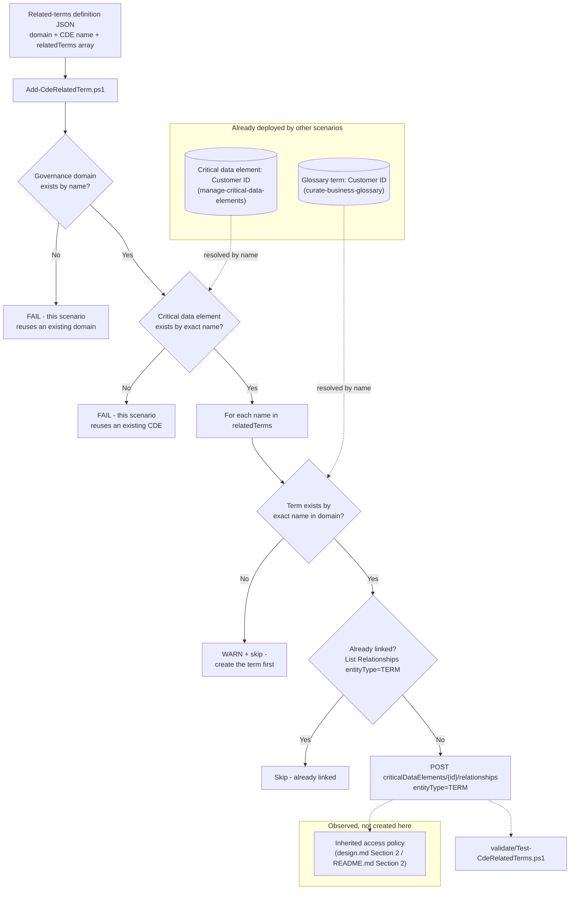

## The short version

Links an existing Microsoft Purview Unified Catalog **critical data element (CDE)** to one or
more existing **glossary terms** - the "Manage related terms" portal action - so a technical
governance object (the CDE, which maps physical columns) and a business-vocabulary object (the
term, which defines what those columns *mean*) point at each other. This is the small, targeted
companion *Manage a Critical Data Element* (the validation steps) named as a
non-goal to keep that fragment scoped to column-mapping: linking terms reuses the identical
Create Relationship operation that scenario already calls for `entityType=CRITICALDATACOLUMN`, just with
`entityType=TERM` instead, and the term-resolution code already exists verbatim in
*Manage a Data Product*.

## Why this matters

Two distinct governance objects - a CDE (technical: which columns) and a term (business: what the
concept means) - are more useful linked than separate. Microsoft's own concept page describes this
directly: "You can link your critical data elements to related glossary terms" via **Manage
related terms**. Beyond legibility, this link has a concrete access-control
consequence Microsoft documents specifically for this triad of business concepts:

- **Inherited access policies.** "You can set policies on governance domains, glossary terms, and
  critical data elements. Data products in the governance domain, or data products that have
  glossary terms or critical data elements applied, inherit and aggregate these policies... if you
  set a manager approval policy on a glossary term applied to the data product, the data product
  also requires manager approval". Once a term is linked to this scenario's
  CDE, and the CDE's own "associated data products" rollup includes a downstream product
  (*Manage a Critical Data Element* (the implementation steps)), an access policy set on that *term* - e.g. a
  manager-approval requirement for a regulated PII concept - aggregates onto every data product the
  CDE touches, without a governance team having to configure the same policy redundantly on each
  product individually.
- **Faster onboarding for a new consumer.** A catalog reader who finds "Customer ID" in the
  Enterprise Glossary's Critical data elements tab can jump straight to the linked "Customer ID"
  *term* for the plain-language definition, instead of inferring meaning from column names alone
  - directly supporting the "blueprint for new sources" framing
  *Manage a Critical Data Element* (why this matters) already documents for the CDE side of this pairing.
- **Consistent regulated-data narrative.** If a CDE is used as a regulated-data inventory entry
  (PCI/GDPR/HIPAA column mapping, per the sibling scenario's why this matters), linking it to the term that
  carries the regulatory definition (e.g. "Cardholder Data") keeps the technical mapping and the
  compliance definition from drifting apart as both are edited independently over time.

## How the control works

Purview Unified Catalog REST API only ([Automation surface](/docs/automation-surface/) surface 4 - **Critical Data
Elements** and **Terms** operation groups). No Data Map/Atlas call and no Microsoft Graph call -
unlike its *Manage a Critical Data Element* sibling, this scenario links two objects that already
carry their own resolvable identity in Unified Catalog.

## What it takes

### Prerequisites

Full licensing detail and citations: [Licensing matrix](/docs/licensing-matrix/). Summary for this scenario:

| Requirement | Minimum | Notes |
|---|---|---|
| Unified Catalog data governance | **Pay-as-you-go (PAYG)**, billed on unique **governed assets/day** | This scenario creates a **relationship** object, not a governed asset - it adds **no incremental governed-asset cost** on its own |
| An existing critical data element | *Manage a Critical Data Element* run at least once | This scenario resolves the CDE by name; it never creates one |
| Existing glossary term(s) | *Curate a Business Glossary* run at least once | Same reuse-by-name pattern for each entry in `relatedTerms` |
| Role to link a critical data element to a term | **Data Steward** on the governance domain (unconfirmed minimum - see below) | Microsoft's own critical-data-elements page scopes CDE creation/column-adding to "data steward and data product owner permissions" but does not separately restate a role requirement for the **Manage related terms** action specifically - this scenario's automation identity requests Data Steward only, the minimum role every other Unified Catalog write action in this domain already requires. [RBAC model, section 5](/docs/rbac-model/#5-data-governance-roles-data-map--unified-catalog---a-separate-model) |
| Automation identity (Unified Catalog only) | Data Steward on the domain | Unlike *Manage a Critical Data Element*, this scenario never resolves an owner via Microsoft Graph and never calls the Data Map/Atlas Entity API - it only reads and links objects that already exist in Unified Catalog, so no Graph token and no Data Map role are needed |

**VERIFY - Data Steward alone may not be sufficient.** The prerequisite table above is an inference
from documentation *silence*, not a directly confirmed minimum: the critical-data-elements page
doesn't restate a role requirement when describing "Manage related terms" specifically, but
silence isn't the same as Microsoft confirming Data Product Owner isn't also needed for this one
action (unlike CDE creation/column-adding, which the same page explicitly requires both roles
for). If a pilot-tenant run of `Add-CdeRelatedTerm.ps1` returns a 403 with only Data Steward
assigned, grant Data Product Owner too before concluding the script is broken.

**The Data Steward role is domain-scoped, not element- or term-scoped** - the identical
over-breadth *Manage a Critical Data Element* (the prerequisites), *Manage a Data Product* (the prerequisites),
and *Curate a Business Glossary* (the prerequisites) already flag for their own domain-level roles applies
here too: a compromised or over-broadly-assigned credential holding this role can link (or unlink)
*any* term to *any* critical data element in its assigned domain(s), not just the pairing this
scenario's config targets. Scope the role assignment to only the domain(s) this automation curates
- see the cross-referenced compensating-controls note in any sibling page.

> Verify current entitlement names against [Licensing matrix](/docs/licensing-matrix/) and the Product Terms before
> a sales commitment. Both underlying features (critical data elements and glossary terms) are
> Microsoft-labeled **preview** as of this build - re-check GA status before a customer-facing
> commitment.

### Cost and licensing

- **This scenario adds no incremental governed-asset cost.** Microsoft's billing model meters
  unique governed **assets** per day - a CDE-to-term
  relationship is not itself a governed asset and carries no separate billing line; the CDE and
  any columns it maps were already billed (or not) by *Manage a Critical Data Element* before this
  scenario ever runs.
- **No per-user license required for the automation itself** - Unified Catalog curation stays
  PAYG-only ([Licensing matrix, section 2](/docs/licensing-matrix/#2-master-capability--license-matrix)).

## Proof it works

1. **Automated check** - `./validate/Test-CdeRelatedTerms.ps1` confirms each term named in the
   definition file exists and is linked to the critical data element, and reports (informational
   only) the total count of `entityType=TERM` relationships the CDE currently has - so a term
   linked outside this scenario's scripts (portal, or the reciprocal flow from the term's own
   Related tab) is visible, not hidden. Exits non-zero on any hard failure.
2. **Portal check** - open the critical data element's details page and confirm the linked term(s)
   appear under its related-terms list.
3. **Reciprocal check** - open the linked glossary term's own **Related** tab and confirm the
   critical data element appears there too - the two portal actions
   (**Manage related terms** on the CDE, "Add critical data element" on the term) describe the
   *same* underlying relationship from either side, per Microsoft's own documentation for both
   flows; this scenario always creates it from the CDE side.

## Where it stops

- **Both underlying features are Microsoft-labeled preview.** Critical data elements' concept page
  title is "Critical data elements (preview)"; re-check GA status before a customer-facing
  commitment.
- **VERIFY - whether linking a *published* term is accepted.** Microsoft's "Create and manage
  glossary terms" page states plainly, for the *reciprocal* flow (linking a CDE to a term from the
  term's own Related tab's "Add critical data element" button): "Glossary terms must be in
  **Draft** state in order to add links; if the term is published, select **Unpublish** on the
  term's page to put it in **Draft** state". The **Manage related terms**
  flow this scenario automates (the "+ Add term" button on the *CDE's* own page) is documented on
  a separate page with no equivalent Draft-state restriction stated. It is
  not confirmed whether this is a genuine difference between the two flows, or an
  incompletely-cross-documented restriction that also applies here. `deploy/Add-CdeRelatedTerm.ps1`
  does not attempt to pre-emptively unpublish a term or otherwise guess at this - if a tenant
  rejects linking a published term, the underlying REST error surfaces directly rather than being
  silently swallowed. Confirm against a pilot tenant before relying on linking a *published* term
  in an unattended pipeline.
- **VERIFY - the Terms Query / Critical Data Elements Query `nameKeyword` filter's exact match
  semantics** - the same open question every sibling Unified Catalog scenario in this library already
  records for its own Query calls (*Curate a Business Glossary* (the known limitations),
  *Manage a Data Product* (the known limitations), *Manage a Critical Data Element* (the known limitations)); this
  scenario applies the identical client-side-exact-match mitigation for both lookups.
- **This scenario does not configure or verify the resulting access-policy aggregation** -
  only the relationship itself, which is the prerequisite for that aggregation to take effect.
- **A term name that resolves to more than one term across domains is not handled specially** -
  `Find-TermByName` scopes its query to the same domain as the critical data element
  (`domainIds`), so a same-named term in a *different* domain is never matched; this is
  intentional, not a gap, since Unified Catalog terms are domain-scoped objects.
- **Deleting the critical data element without first unlinking its terms will fail against
  Microsoft's own documented delete prerequisite.** The concept page states plainly: "To delete a
  critical data element, you need to unpublish it and delete all columns within it, and any links
  to glossary terms". `manage-critical-data-elements/deploy/
  Remove-CriticalDataElement.ps1`'s own `-Purge` predates this scenario and does not remove TERM
  relationships - run `./deploy/Remove-CdeRelatedTerm.ps1 -RemoveAll` first if the CDE has any
  related terms.