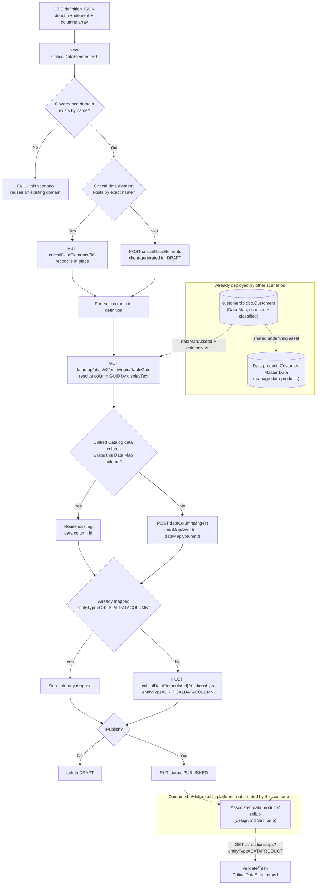

## The short version

Creates a **critical data element (CDE)** in Microsoft Purview Unified Catalog - a governance-domain-scoped
logical concept ("Customer ID") that maps one or more physical columns from one or more data
assets into a single thing a data quality rule, an access policy, or a data consumer can reason
about once - resolves and maps a real, already-scanned column to it, and validates Microsoft's
own automatically-computed "associated data products" rollup as a live cross-check against this
library's *Manage a Data Product* scenario. This is the piece that answers a question neither of
this library's other two Unified Catalog scenarios can: not "which table is authoritative" (that's a
data product) and not "what does this business term mean" (that's a glossary term), but "which
*columns*, across however many source systems, are actually the same piece of information."

## Why this matters

A critical data element exists because not every column deserves the same governance attention.
Microsoft's own framing: "Not all data elements have the same importance or sensitivity.
Dedicating resources to manage the quality of all data indiscriminately can be impractical and
costly". A CDE lets a governance team name the handful of columns -
customer identifiers, financial identifiers, regulated PII - that actually warrant elevated
scrutiny, and then attach data quality rules and access policies to that named concept instead of
re-deriving "which columns matter" from scratch on every project.

Beyond that operational driver, this scenario supports:
- **Regulatory data inventories** - PCI-DSS, GDPR, and HIPAA all effectively require an
  organization to know where a specific category of regulated data lives across every system that
  stores it. A CDE named "Customer ID" (or, in a straightforward extension of this same pattern,
  "Social Security Number" or "Cardholder Data") *is* that inventory, expressed as a first-class,
  API-manageable Purview object rather than a spreadsheet maintained outside the platform.
- **Cross-system data quality accountability** - Microsoft Purview Data Quality can measure and
  score critical data elements specifically, not just individual table columns
  - a CDE-level quality score answers "is our
  customer identifier trustworthy everywhere it appears," a question no single table's own DQ
  score can answer alone.
- **Consistent onboarding for new sources** - Microsoft's own framing: "when data producers create
  a new asset, they can use this element as a blueprint to provide quality information in the
  correct format" - a named CDE gives a new source's owner something
  concrete to map their own "CustID"-equivalent column against, instead of guessing.

## How the control works

Both the **Purview Unified Catalog REST API** ([Automation surface](/docs/automation-surface/) surface 4 -
**Critical Data Elements** and **Data Columns** operation groups) and, for the first time in this
repo, the **Data Map/Atlas Entity API** (the same surface 4 family
*Close Gaps and Validate End-to-End Customer Data Lineage*/*Model a Custom Transform as a Process Node (DataSet -> Process -> DataSet)* use) from the same script, plus
**Microsoft Graph** (surface 3) for owner-identity resolution.

## What it takes

### Prerequisites

Full licensing detail and citations: [Licensing matrix](/docs/licensing-matrix/). Summary for this scenario:

| Requirement | Minimum | Notes |
|---|---|---|
| Unified Catalog data governance | **Pay-as-you-go (PAYG)**, billed on unique **governed assets/day** | See section 10 - this scenario typically adds **no incremental cost** when it maps a column that already belongs to an asset another data product or CDE already governs |
| A completed scan | *Scan Azure SQL Database and Classify Sensitive Columns* run at least once | This scenario consumes that scenario's output (a Data Map asset GUID) - it does not scan anything itself |
| The governance domain | *Curate a Business Glossary* run at least once, **published** | This scenario looks up the domain by name rather than creating one; Microsoft's docs require the domain to be published before a CDE within it can be published |
| Role to create/edit a critical data element and add columns | **Data Steward AND Data Product Owner**, both, on the governance domain | Microsoft's own prerequisite: "To create critical data elements and add columns to them, you must have data steward and data product owner permissions" - a stricter combined requirement than *Manage a Data Product*' Data Product Owner-only prerequisite. [RBAC model, section 5](/docs/rbac-model/#5-data-governance-roles-data-map--unified-catalog---a-separate-model) |
| Role to resolve column GUIDs from Data Map | **Data Reader** on the asset's Data Map collection | Same as *Manage a Data Product* (the prerequisites)'s Data Map access note; needed here because this scenario, unlike its siblings, reads the table entity directly from Data Map/Atlas |
| Automation identity (Unified Catalog + Data Map + Graph) | Data Steward + Data Product Owner in Unified Catalog, Data Reader on the Data Map collection, `User.Read.All` application permission in Graph | Same service-principal pattern as *Manage a Data Product*; this scenario's identity additionally calls the Data Map/Atlas Entity API directly |

**The Data Steward/Data Product Owner role pair is domain-scoped, not element-scoped** - the same
over-breadth *Manage a Data Product* (the prerequisites) and *Curate a Business Glossary* (the prerequisites)
already flag for their own domain-level roles applies identically here: a compromised or
over-broadly-assigned credential holding this role pair can create, edit, or unpublish *any*
critical data element (or data product, or glossary term) in its assigned domain(s), not just the
"Customer ID" element this scenario's config targets. Scope the role assignment to only the
domain(s) this automation curates - see the cross-referenced compensating-controls note in either
sibling page.

> Verify current entitlement names against [Licensing matrix](/docs/licensing-matrix/) and the Product Terms before
> a sales commitment - SKU names and PAYG meters change. This entire feature is Microsoft-labeled
> **preview** as of this build (the concept page's own title is "Critical data elements
> (preview)") - re-check GA status before a customer-facing commitment.

### Cost and licensing

- **Governed-asset billing is deduplicated across concepts, confirmed directly by Microsoft's
  billing FAQ:** "I have the same data asset attached to both a data product and a critical data
  element. How am I charged? You aren't charged for a data asset attached to both a data product
  and a critical data element. You're charged for a data asset once." This
  scenario's default configuration maps a column belonging to
  *Manage a Data Product*' already-governed `customerdb.dbo.Customers` asset, so it adds **zero**
  incremental governed-asset cost in that configuration.
- **Mapping a column from a previously-ungoverned asset does trigger billing**, the same
  per-unique-governed-asset-per-day meter *Manage a Data Product* (the cost and licensing notes) documents - a CDE
  is one of the governance concepts Microsoft's billing model explicitly names as a billing
  trigger, on equal footing with a data product.
- **No per-user license required for the automation itself** - Unified Catalog curation stays
  PAYG-only ([Licensing matrix, section 2](/docs/licensing-matrix/#2-master-capability--license-matrix)).

## Proof it works

1. **Automated check** - `./validate/Test-CriticalDataElement.ps1` confirms the critical data
   element exists with the expected data type/description/owner, confirms each configured column
   resolves and is mapped, and reports (does not fail on) the DATAPRODUCT relationship rollup as
   an informational cross-check. Exits non-zero on any hard failure (safe for a CI-style
   pre-flight).
2. **Portal check** - Purview portal → Unified Catalog → **Discovery** → **Enterprise glossary** →
   **Critical data elements** tab → open `Customer ID` → confirm the **Overview** tab lists the
   mapped `CustomerID` column and, if *Manage a Data Product* has already run, `Customer Master
   Data` under **Associated data products**.
3. **Cross-scenario check** - open the linked `customerdb.dbo.Customers` asset's own **Governance**
   tab and confirm `Customer ID` appears under "Critical data elements associated with columns in
   the asset" - proof the mapping is bidirectional, not just visible from
   the CDE side.

## Where it stops

- **This feature is Microsoft-labeled preview.** The concept documentation's own page title is
  "Critical data elements (preview)," and the bulk-CSV-import path is separately labeled preview
  again. Re-check GA status before a customer-facing commitment.
- **`entityType=CRITICALDATACOLUMN` (resolved 2026-09-27).** An earlier build flagged a
  discrepancy between the worked examples and the formally-documented `EntityCategory` enum on
  the Critical Data Elements Create/List/Delete Relationship reference pages. A re-fetch of all
  three pages confirmed the enum now lists `CRITICALDATACOLUMN` explicitly, matching every worked
  example - there is no plain `DATACOLUMN` value in the enum. This scenario's scripts send
  `CRITICALDATACOLUMN`.
- **VERIFY - whether the DATAPRODUCT relationship rollup is actually observable via this REST
  call.** Microsoft's portal documentation describes the "associated data products" list as
  automatically computed, but no Microsoft Learn page this build's grounding pass found confirms
  it is surfaced through **Critical Data Elements - List Relationships** with
  `entityType=DATAPRODUCT` specifically. `validate/Test-CriticalDataElement.ps1`
  treats an empty result as a `[WARN]`, not a `[FAIL]`.
- **Column-name matching is case-sensitive exact match** against
  `entity.relationshipAttributes.columns[].displayText`. A column whose display name differs in
  case from the definition file's `columnName` will not be found - flagged inline in
  `deploy/New-CriticalDataElement.ps1`'s `.NOTES`.
- **VERIFY - the Critical Data Elements Query `nameKeyword` filter's exact match semantics**, the
  same open question *Curate a Business Glossary* (the known limitations) and
  *Manage a Data Product* (the known limitations) record for their own object types - this scenario applies
  the identical client-side-exact-match mitigation.
- **No REST `Delete` operation exists for a Unified Catalog data column wrapper**, as of API
  version `2026-03-20-preview`. the rollback runbook documents this as a genuine capability gap, not a
  scope choice.
- **This scenario does not link the critical data element to glossary terms or configure its
  access policy** - both are portal-only or out of this build's grounding, per the design notes's
  non-goal list.
- **Deleting the Data Map entity used to resolve a column's GUID leaves the mapping stale**, the
  same "removed from Data Map, still shows in Unified Catalog until manually removed" behavior
  Microsoft documents for CDE columns generally - this scenario's validate
  script will report a `[FAIL]` on the affected column (it can no longer be re-resolved from Data
  Map) rather than silently passing.