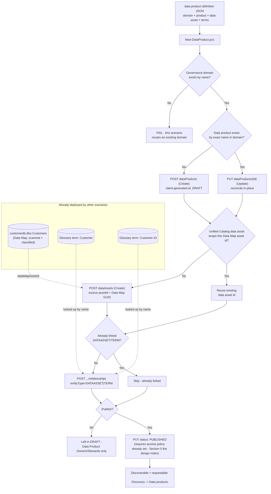

## The short version

Creates a **data product** in Microsoft Purview Unified Catalog - a named, ownable, requestable
grouping of data assets with a business use case attached - wraps an already-scanned Azure SQL
table as a Unified Catalog data asset, and links both that asset and its governing glossary terms
to the product, all from a single declarative JSON file. This is the piece that turns this
library's earlier Unified Catalog and Data Map scenarios into something a business consumer can
actually find and request: a scanned table with a governed glossary term is still, on its own,
just a scanned table with a label - a data product is what makes it discoverable, requestable, and
ownable as "Customer Master Data" instead of `customerdb.dbo.Customers`.

## Why this matters

Data products are Unified Catalog's answer to a specific, recurring failure mode: a consumer who
needs "the customer table" has to request access to 15 similarly-named tables individually, and a
data owner who tightens a use-case policy has to update each of those tables' permissions one at a
time. Grouping them into one data product means one access request, one
policy surface, and one place a data owner curates description/use-case/ownership as the
underlying assets change.

Beyond that operational driver, this scenario supports:
- **Least-privilege access requests** - a consumer requests exactly the data product they need,
  through a tracked, approvable workflow, rather than being granted broad Data Map
  collection access "to be safe."
- **SOC 2 / ISO 27001 access-governance evidence** - every access request against a published data
  product is logged and tiered through named approvers, a stronger audit
  trail than ad hoc table-level permission grants.
- **Data quality accountability** - a data product carries an aggregate data-quality score computed
  from its linked assets, directly consuming the output of
  *Configure Rules and Review Scorecards for a Governed Data Asset* once that scenario's rules are applied to this
  same "Customer" asset.

## How the control works

One Unified Catalog **data product**, one Unified Catalog **data asset** wrapper, and their
relationships - all authored via the **Purview Unified Catalog REST API**
([Automation surface](/docs/automation-surface/) surface 4). The one place this scenario also calls **Microsoft
Graph** (surface 3) is owner-identity resolution, same as *Curate a Business Glossary* (the implementation steps).

## What it takes

### Prerequisites

Full licensing detail and citations: [Licensing matrix](/docs/licensing-matrix/). Summary for this scenario:

| Requirement | Minimum | Notes |
|---|---|---|
| Unified Catalog data governance | **Pay-as-you-go (PAYG)**, billed on unique **governed assets/day** | Unlike *Curate a Business Glossary*, **this scenario does incur a charge** - see section 10. Linking a real data asset to a data product is exactly the billing trigger Microsoft's FAQ describes |
| A completed scan | *Scan Azure SQL Database and Classify Sensitive Columns* run at least once | This scenario consumes that scenario's output (a Data Map asset GUID for `customerdb.dbo.Customers`) - it does not scan anything itself |
| The governing terms | *Curate a Business Glossary* run at least once (with `-Publish` if the terms should be linkable in a published state) | This scenario looks up `Customer` and `Customer ID` by name in the same domain rather than creating them |
| Role to author the data product | **Data Product Owner** (governance-domain-level role, assigned on the domain's **Roles** tab - same role model as `Data Steward`) | [RBAC model, section 5](/docs/rbac-model/#5-data-governance-roles-data-map--unified-catalog---a-separate-model) |
| Role to link the underlying Data Map asset | **Data Reader** on the asset's Data Map collection, in addition to Data Product Owner in Unified Catalog | Two separate role systems - [RBAC model, section 5](/docs/rbac-model/#5-data-governance-roles-data-map--unified-catalog---a-separate-model)'s "Rule of thumb" |
| Automation identity (Unified Catalog + Graph) | Same service-principal pattern as *Curate a Business Glossary*: Data Product Owner in Unified Catalog, `User.Read.All` application permission in Graph | the prerequisites's compensating-controls note in *Curate a Business Glossary* applies identically here - this scenario resolves the data product's owner the same way |
| **Manual, portal-only prerequisite before `-Publish`** | A **data product access policy** configured via **Manage policies** on the data product's details page | Microsoft's own docs: "Before you can publish, you need to add data assets to your data product and set up a data access policy" - the design notes explains why this scenario cannot script it |

> Verify current entitlement names against [Licensing matrix](/docs/licensing-matrix/) and the Product Terms before
> a sales commitment - SKU names and PAYG meters change.

### Cost and licensing

- **Unlike *Curate a Business Glossary*, this scenario incurs a PAYG charge.** Microsoft's billing
  FAQ is explicit about the trigger: creating domains and data products with nothing attached costs
  nothing, but once a data asset is linked, billing is **per unique governed asset per day**. This scenario links exactly one governed asset
  (`customerdb.dbo.Customers`), so it adds one billed asset - deduplicated if that same asset is
  also linked from other data products, glossary terms, or critical data elements
  - not one charge per relationship this scenario creates.
- **No per-user license required for the automation itself** - Unified Catalog curation stays
  PAYG-only ([Licensing matrix, section 2](/docs/licensing-matrix/#2-master-capability--license-matrix)). A human requesting access to the resulting data
  product still needs whatever license the underlying data asset's own access model requires
  (e.g. an Azure SQL Database role) - Unified Catalog access policies gate the *request* workflow,
  not the underlying data-plane permission grant itself.

## Proof it works

1. **Automated check** - `./validate/Test-DataProduct.ps1` confirms the data product exists with
   the expected type/description/updateFrequency/audience/owner-contact, confirms the data asset
   wrapper and both relationships exist, and reports the classifications Data Map scanning found on
   the underlying asset. Exits non-zero on any hard failure (safe for a CI-style pre-flight).
   Publish status is reported as a warning, not a hard failure.
2. **Portal check** - Purview portal → Unified Catalog → **Discovery** → **Data products** →
   explore the `Customer Experience` domain → open `Customer Master Data` → confirm the **Details**
   tab shows the expected description/use case/owner, and the **Data assets** and **Glossary
   terms** sections both list one item.
3. **Consumer-visibility check (after `-Publish` and a configured access policy)** - as a
   **Catalog Reader**-only account, search Unified Catalog **Discovery** for "Customer" and confirm
   `Customer Master Data` appears with a working **Request access** button.
4. **Cross-scenario check** - open the linked `customerdb.dbo.Customers` asset's own **Governance**
   tab and confirm `Customer Master Data` appears under "Data products the asset is part of"
   - proof the link is bidirectional, not just visible from the product side.

## Where it stops

- **`-Publish` requires a portal-only access policy this scenario cannot configure.** the design notes covers this in full; the practical effect is that a first-time `-Publish` run against a data
  product with no access policy configured may fail, and this scenario cannot tell you why beyond
  the `Write-Warning` printed before the attempt.
- **VERIFY - whether the REST `Update` operation enforces the access-policy prerequisite
  server-side, or only the portal UI does.** Not documented either way. If the
  REST call does *not* enforce it, this script could technically publish a data product with no
  access-request path configured for consumers - a real gap flagged in the Red Team review.
- **CLOSED (2026-09-27) - the `Data Products - Create Relationship` request body for
  `entityType=DATAASSET` and `entityType=TERM`.** The REST reference's only worked example uses
  `entityType=CRITICALDATACOLUMN` (a value absent from that same page's own `EntityCategory` enum)
  and includes an `assetId` field this script's `DATAASSET`/`TERM` calls omit - but this is a
  documentation-generation artifact, not a real per-`entityType` schema. Every sibling
  relationship-creation operation documents the plain `entityId`/`description`/`relationshipType`
  shape this script already sends: **Data Assets - Create Relationship**, **Critical Data Elements - Create Relationship**
  (the operation that actually manages CDE relationships), and even Data Products - Create
  Relationship's own `DataProductRelationship` response type. No code change needed
  (the design notes, inline `.NOTES` in `deploy/New-DataProduct.ps1`).
- **The two "Policies" concepts in Unified Catalog are not the same thing.** The REST API's
  `Policies` operation group returns the underlying RBAC authorization-policy engine (attribute/
  decision rules keyed by domain/product GUIDs) - **not** the "who can request access, what do they
  attest to" data product access policy the portal's **Manage policies** button configures. This scenario does not call the `Policies` REST operation group at all; do not
  assume it can be used to script access policies.
- **`nameKeyword` match semantics are undocumented**, the same open question
  *Curate a Business Glossary* (the known limitations) records for Query Terms - this scenario's
  `Find-DataProductByName` applies the identical client-side-exact-match mitigation and inherits
  the identical pagination caveat for very large domains.
- **Portal type labels vs. REST `type` enum values don't map one-to-one** - see the configuration reference's configuration
  reference note. Confirm the correct mapping before building a curator-facing UI on top of this
  script's config file format.
- **This scenario does not configure critical data elements or OKR links**, and does not register
  or scan the underlying Data Map source - the design notes has the full non-goal list.
- **Deleting the Unified Catalog data asset wrapper is opt-in and unchecked.**
  `Remove-DataProduct.ps1 -Purge -DeleteDataAssetWrapper` cannot confirm another data product isn't
  still referencing the same wrapper before deleting it - see the rollback runbook.