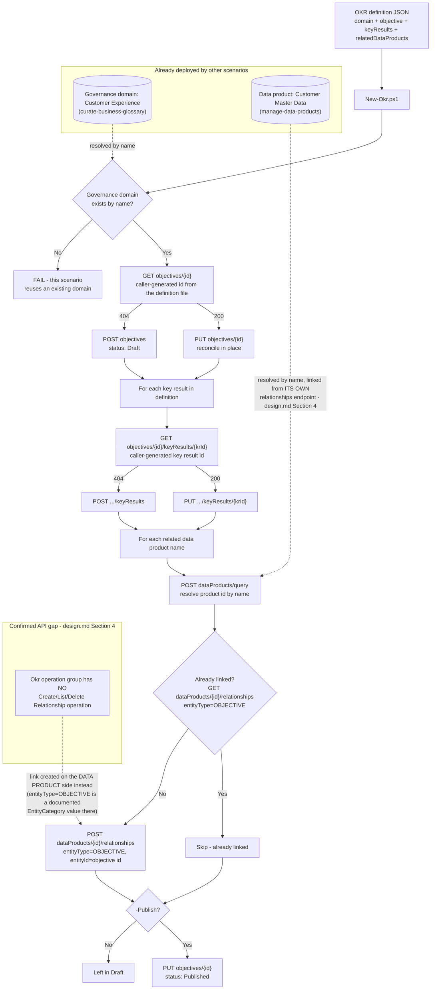

## The short version

Creates an **objective and key results (OKR)** in Microsoft Purview Unified Catalog - a
governance-domain-scoped business goal ("increase trust in customer master data") with
measurable key results - and links it to one or more already-existing **data products**, so a
business sponsor can see, directly inside the catalog, which curated data actually drives or
measures their goal. This is the piece that connects this library's other two Unified Catalog
scenarios (*Manage a Data Product*, *Manage a Critical Data Element*) - which describe *what the
data is* and *which columns matter* - to *why any of it matters to the business*.

## Why this matters

Microsoft's own framing for why OKRs exist inside a data catalog, not a separate OKR tool: "OKRs
link data products directly to real business objectives to bridge the gap between the business
and the data estate. Data governance isn't just an IT task or engineering best practice, it's a
critical part of value generation". Concretely:

- **Funding narrative for a CISO or data governance sponsor.** A governance program that can point
  to a named, owned, target-dated business objective - "reduce duplicate customer records from 8%
  to under 2%" - with a live key-result score and a direct link to the data product being
  governed, is a materially stronger budget conversation than "we govern 20 tables." This mirrors
  Microsoft's own worked example: a "Customer Response" OKR linked to an email-campaign-results
  data product.
- **Making a health/quality investment legible to non-technical stakeholders.** A key result's
  `progress`/`goal`/`max` triple is a business metric, not a technical one - it's the same
  vocabulary a business review already uses, deliberately, so a data quality improvement (fewer
  duplicate customer IDs) reads as a business outcome instead of an IT ticket.
- **Traceable accountability.** Each OKR has one or more named owners
  (`contacts.owner[]`) - Microsoft's own guidance: "these users are responsible for maintaining a
  business objective... [and] should have knowledge of how the business functions"
  - giving a governance program a named accountable business sponsor per
  objective, not just a technical data steward.

## How the control works

Uses the **Purview Unified Catalog REST API** ([Automation surface](/docs/automation-surface/) surface 4) - the
**Okr** operation group for the objective/key-result CRUD, and the **Data Products** operation
group's own relationship operations (`entityType=OBJECTIVE`) for the data-product link - plus
**Microsoft Graph** (surface 3) for owner-identity resolution.

## What it takes

### Prerequisites

Full licensing detail and citations: [Licensing matrix](/docs/licensing-matrix/). Summary for this scenario:

| Requirement | Minimum | Notes |
|---|---|---|
| Unified Catalog data governance | **Pay-as-you-go (PAYG)**, billed on unique **governed assets/day** | section 10 - this scenario adds **no** governed-asset billing event of its own (it never attaches a raw data asset to anything; it links an objective to an already-governed data product) |
| The governance domain | *Curate a Business Glossary* run at least once, **published** before `-Publish` | This scenario looks up the domain by name rather than creating one; Microsoft's docs require the domain to already be published before an OKR within it can be published |
| A data product to link to (recommended, not required) | *Manage a Data Product* run at least once | The default definition file links to *Manage a Data Product*' own "Customer Master Data" product; omit `relatedDataProducts` to create a standalone OKR with nothing to link yet |
| Role to create/edit OKRs | **Steward role**, domain-scoped | Microsoft's own prerequisite: "To create and edit OKRs, you need the steward role" - a *lighter* requirement than *Manage a Critical Data Element*' combined Data Steward + Data Product Owner requirement (the prerequisites there), matching *Curate a Business Glossary*'s own steward-only bar for glossary terms. [RBAC model, section 5](/docs/rbac-model/#5-data-governance-roles-data-map--unified-catalog---a-separate-model) |
| Role to link a data product (the relationship call is made on the *product*, not the OKR - the design notes) | **Data Product Owner**, domain-scoped | Same role *Manage a Data Product* (the prerequisites) already requires for its own `Create Relationship` calls |
| Automation identity (Unified Catalog + Graph) | Data Steward + Data Product Owner in Unified Catalog, `User.Read.All` application permission in Graph | Same service-principal pattern as *Manage a Data Product*/*Manage a Critical Data Element* |

**The Data Steward/Data Product Owner role pair is domain-scoped, not OKR-scoped** - the identical
over-breadth *Manage a Data Product* (the prerequisites), *Manage a Critical Data Element* (the prerequisites),
and *Curate a Business Glossary* (the prerequisites) already flag for their own domain-level roles applies
here too: scope the role assignment to only the domain(s) this automation curates.

> Verify current entitlement names against [Licensing matrix](/docs/licensing-matrix/) and the Product Terms before
> a sales commitment. This entire feature is Microsoft-labeled **preview** as of this build (the
> concept page's own title is "Objectives and key results (OKRs) (preview)") - re-check GA status
> before a customer-facing commitment.

### Cost and licensing

- **This scenario adds no governed-asset billing event of its own.** Microsoft's billing FAQ
  defines a governed asset as a raw data asset (table/view) attached to a data product, critical
  data element, glossary term, or data quality rule - OKRs are conspicuously
  absent from that enumeration, and this scenario only links an objective to an
  **already-governed** data product, never to a raw data asset directly. Not independently
  confirmed by a dedicated Microsoft billing example naming OKRs specifically - flagged as a
  reasoned inference from the billing FAQ's own enumeration, not an asserted fact.
- **No per-user license required for the automation itself** - Unified Catalog curation stays
  PAYG-only ([Licensing matrix, section 2](/docs/licensing-matrix/#2-master-capability--license-matrix)).

## Proof it works

1. **Automated check** - `./validate/Test-Okr.ps1` confirms the objective exists (by id) with the
   expected definition text/owner/domain, confirms each key result exists with matching
   progress/goal/max/status, and reports (does not fail on) whether each named data product is
   linked. Exits non-zero on any hard failure (safe for a CI-style pre-flight).
   `./validate/Test-OkrProgressTrend.ps1` checks a different thing - the progress-trend companion's
   own trend-log file integrity, plus (with `-FailOnStale`) whether the most recent run flagged any
   entity as stale - see operations and tuning.
2. **Portal check** - Purview portal → Unified Catalog → **Discovery** → **Enterprise glossary** →
   **OKRs** tab → open the objective → confirm both key results and, if *Manage a Data Product* has
   already run, `Customer Master Data` under linked data products.
3. **Cross-scenario check** - open the `Customer Master Data` data product's own details page and
   confirm the objective appears wherever the portal surfaces its own linked OKRs - proof the
   relationship is visible from the product side too, since that's the side this scenario actually
   calls to create it.

## Where it stops

- **This feature is Microsoft-labeled preview.** The concept page's own title is "Objectives and
  key results (OKRs) (preview)." Re-check GA status before a customer-facing commitment.
- **Identity is id-based, not name-based - a deliberate departure from this library's other Unified
  Catalog scenarios.** Because Microsoft's own docs state OKR names are explicitly allowed to
  duplicate, this scenario requires the operator to pre-generate and pin a GUID per objective/key
  result in the definition file rather than relying on a name lookup. Losing track
  of a previously-generated id (e.g. checking in a definition file without it) means the next run
  cannot find the existing objective and - because the id field itself is required on Create - the
  run fails loudly rather than silently duplicating; it does not, however, self-heal by searching
  for a same-name objective.
- **VERIFY - the `additionalProperties` field's request-body shape differs between the Okr -
  Create/Get reference (an object of computed roll-up fields) and the Okr - Update reference (an
  enum) for the same field name on the same resource.** This scenario never sends
  `additionalProperties` on either call - the design notes - reasoning that a computed roll-up has no
  well-typed client value regardless of which documented shape is correct, but the underlying
  discrepancy itself is unresolved.
- **VERIFY - whether a key result's own `domainId` is validated against its parent objective's
  domain, or accepted independently.** This scenario always sends the same value for both - the
  only configuration the portal itself permits - but has not tested a deliberately mismatched
  value against a live tenant.
- **`goal`/`max`/`progress` are direction-agnostic** - nothing in Microsoft's docs states whether a
  key result's metric should increase or decrease toward its goal. This scenario's own sample file
  models one of each (an increasing quality-coverage metric and a decreasing duplicate-rate
  metric) precisely to surface this ambiguity rather than hide it - a naive progress-bar rendering
  built on top of this data (not something Microsoft's own portal appears to attempt, based on the
  create/edit flow's plain numeric fields) could misrepresent a decreasing metric's progress.
- **No REST way to link a key result (as opposed to its parent objective) to a data product** is
  scripted, even though `KEYRESULT` is a documented `EntityCategory` enum value on the Data
  Products relationship operations - the portal exposes no discoverable action that would call it, so this scenario doesn't guess at what it's for.
- **This scenario does not compute or refresh a key result's `progress` from any live data
  source.** See operations and tuning - progress is whatever the definition file says until an operator
  updates it and re-runs `New-Okr.ps1`. `deploy/Export-OkrProgressTrend.ps1` detects the
  *absence* of a change over time; it cannot detect a *wrong* or *stalled* underlying metric that
  happens to still be getting re-entered on a cadence.
- **No Microsoft-side change history exists for an Okr/Key Result object.** Re-confirmed by this
  companion's own build: the "Audit log activities" reference's "Microsoft Purview governance
  activities" category (`EntityCreated`/`EntityUpdated`/`EntityDeleted`, `Classification*`,
  `GlossaryTerm*`, `SensitivityLabelChanged`) lists no Objective/KeyResult/OKR-specific operation -
  corroborating, but not conclusively proving (that category describes the classic Atlas-based
  entity model, a different, older surface than the Unified Catalog OKR REST API), the original
  "no notification surface" finding from the review notes Round 1's Blue Team section.
  `deploy/Export-OkrProgressTrend.ps1`'s own local
  trend-log CSV is therefore the only historical record of an OKR's progress this library can
  produce - a client-side compensating control, not a read of any Microsoft-side audit trail. Losing
  or resetting that CSV file loses all staleness history (every remaining entity re-baselines on the
  next run, silently un-flagging anything that was previously stale).
- **The staleness comparison is a plain string/value match, not a semantic one.** A progress value
  that round-trips through the API with a different but numerically-equal string representation
  (e.g. `45` vs `45.0`) would be misread as "changed" when nothing meaningful did. Not observed in
  this scenario's own testing, but not independently verified against a live tenant either - VERIFY
  (pilot tenant).
- **Deleting the linked data product does not automatically unlink the objective** - this
  scenario's rollback and validate scripts re-resolve the product by name on every run; if it no
  longer exists, `Add-ObjectiveToDataProduct`/the validate check both report the condition rather
  than failing to run.